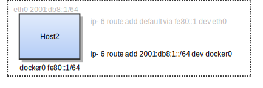
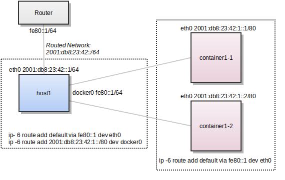
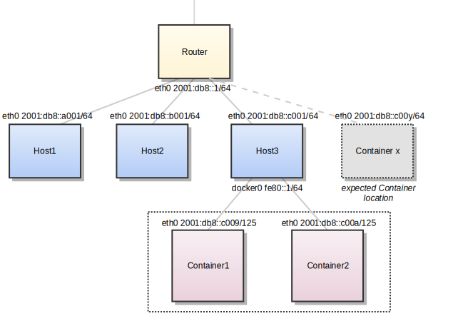
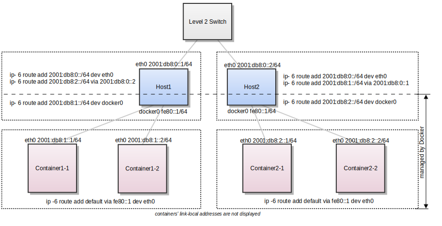
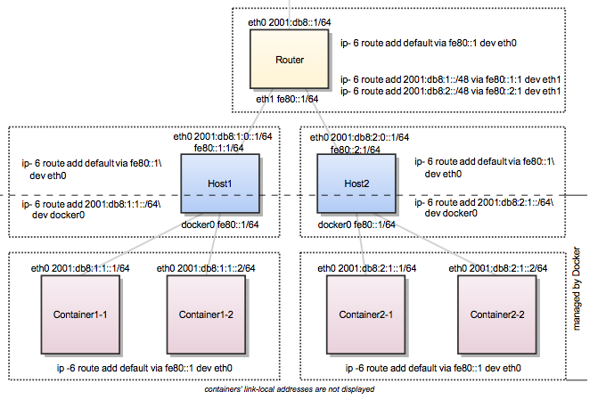

# IPv6 and Containers Explained

[toc]

# TL;DR

* Containers run IPv6 natively and sandboxing is a Linux thing not docker specific!
* Info on Docker and IPv6 is wrong/confusing, it explains how to run the docker deamon in dual stack mode and has nothing to do with the actual docker networks and/or docker ipam used internally.


With the introduction of the Docker networks feature, you can create your own user-defined networks. The Docker default bridge is created when you install Docker Engine. It is a `bridge` network and is also named `bridge`. The topics in this section are related to interacting with that default bridge network.

* [Understand container communication](http://docs.docker.oeynet.com/engine/userguide/networking/default_network/container-communication/)
* [Legacy container links](http://docs.docker.oeynet.com/engine/userguide/networking/default_network/dockerlinks/)
* [Binding container ports to the host](http://docs.docker.oeynet.com/engine/userguide/networking/default_network/binding/)
* [Build your own bridge](http://docs.docker.oeynet.com/engine/userguide/networking/default_network/build-bridges/)
* [Configure container DNS](http://docs.docker.oeynet.com/engine/userguide/networking/default_network/configure-dns/)
* [Customize the docker0 bridge](http://docs.docker.oeynet.com/engine/userguide/networking/default_network/custom-docker0/)
* [IPv6 with Docker](http://docs.docker.oeynet.com/engine/userguide/networking/default_network/ipv6/)

**Source:** http://docs.docker.oeynet.com/engine/userguide/networking/default_network/ipv6/

# IPv6 with Docker

The information in this section explains IPv6 with the Docker default bridge. This is a `bridge` network named `bridge` created automatically when you install Docker.

As we are [running out of IPv4 addresses](http://en.wikipedia.org/wiki/IPv4_address_exhaustion) the IETF has standardized an IPv4 successor, [Internet Protocol Version 6](http://en.wikipedia.org/wiki/IPv6) , in [RFC 2460](https://www.ietf.org/rfc/rfc2460.txt). Both protocols, IPv4 and IPv6, reside on layer 3 of the [OSI model](http://en.wikipedia.org/wiki/OSI_model).

## How IPv6 works on Docker

By default, the Docker daemon configures the container network for IPv4 only. You can enable IPv4/IPv6 dualstack support by running the Docker daemon with the `--ipv6` flag. Docker will set up the bridge `docker0` with the IPv6 [link-local address](http://en.wikipedia.org/wiki/Link-local_address) `fe80::1`.

By default, containers that are created will only get a link-local IPv6 address. To assign globally routable IPv6 addresses to your containers you have to specify an IPv6 subnet to pick the addresses from. Set the IPv6 subnet via the `--fixed-cidr-v6` parameter when starting Docker daemon:

You can run `dockerd` with these flags directly, but it is recommended that you set them in the [`daemon.json`](http://docs.docker.oeynet.com/engine/reference/commandline/dockerd/#daemon-configuration-file) configuration file instead. The following example `daemon.json` enables IPv6 and sets the IPv6 subnet to `2001:db8:1::/64`.

```
{
  "ipv6": true,
  "fixed-cidr-v6": "2001:db8:1::/64"
}
```

The subnet for Docker containers should at least have a size of `/80`, so that an IPv6 address can end with the container’s MAC address and you prevent NDP neighbor cache invalidation issues in the Docker layer.

By default, `--fixed-cidr-v6` parameter causes Docker to add a new route to the routing table, by basically running the three commands below on your behalf. To prevent the automatic routing, set `ip-forward` to `false` in the `daemon.json` file or start the Docker daemon with the `--ip-forward=false` flag. Then, to get the same routing table that Docker would create automatically for you, issue the following commands:

```
$ ip -6 route add 2001:db8:1::/64 dev docker0

$ sysctl net.ipv6.conf.default.forwarding=1

$ sysctl net.ipv6.conf.all.forwarding=1
```

All traffic to the subnet `2001:db8:1::/64` will now be routed via the `docker0` interface.

> **Note**: IPv6 forwarding may interfere with your existing IPv6 configuration: If you are using Router Advertisements to get IPv6 settings for your host’s interfaces, set `accept_ra` to `2` using the following command. Otherwise IPv6 enabled forwarding will result in rejecting Router Advertisements.
>
> $ sysctl net.ipv6.conf.eth0.accept_ra=2



Every new container will get an IPv6 address from the defined subnet, and a default route will be added on `eth0` in the container via the address specified by the daemon option `--default-gateway-v6` (or `default-gateway-v6` in `daemon.json`) if present. The default gateway defaults to `fe80::1`.

This example provides a way to examine the IPv6 network settings within a running container.

```
docker run -it alpine ash -c "ip -6 addr show dev eth0; ip -6 route show"

15: eth0: <BROADCAST,UP,LOWER_UP> mtu 1500
   inet6 2001:db8:1:0:0:242:ac11:3/64 scope global
      valid_lft forever preferred_lft forever
   inet6 fe80::42:acff:fe11:3/64 scope link
      valid_lft forever preferred_lft forever

2001:db8:1::/64 dev eth0  proto kernel  metric 256
fe80::/64 dev eth0  proto kernel  metric 256
default via fe80::1 dev eth0  metric 1024
```

In this example, the container is assigned a link-local address with the subnet `/64` (`fe80::42:acff:fe11:3/64`) and a globally routable IPv6 address (`2001:db8:1:0:0:242:ac11:3/64`). The container will create connections to addresses outside of the `2001:db8:1::/64` network via the link-local gateway at `fe80::1` on `eth0`.

Often servers or virtual machines get a `/64` IPv6 subnet assigned (e.g. `2001:db8:23:42::/64`). In this case you can split it up further and provide Docker a `/80` subnet while using a separate `/80` subnet for other applications on the host:



In this setup the subnet `2001:db8:23:42::/64` with a range from `2001:db8:23:42:0:0:0:0` to `2001:db8:23:42:ffff:ffff:ffff:ffff` is attached to `eth0`, with the host listening at `2001:db8:23:42::1`. The subnet `2001:db8:23:42:1::/80` with an address range from `2001:db8:23:42:1:0:0:0` to `2001:db8:23:42:1:ffff:ffff:ffff` is attached to `docker0` and will be used by containers.

### Using NDP proxying

If your Docker host is the only part of an IPv6 subnet but does not have an IPv6 subnet assigned, you can use NDP proxying to connect your containers to the internet via IPv6. If the host with IPv6 address `2001:db8::c001` is part of the subnet `2001:db8::/64` and your IaaS provider allows you to configure the IPv6 addresses `2001:db8::c000` to `2001:db8::c00f`, your network configuration may look like the following:

```
$ ip -6 addr show

1: lo: <LOOPBACK,UP,LOWER_UP> mtu 65536
    inet6 ::1/128 scope host
       valid_lft forever preferred_lft forever
2: eth0: <BROADCAST,MULTICAST,UP,LOWER_UP> mtu 1500 qlen 1000
    inet6 2001:db8::c001/64 scope global
       valid_lft forever preferred_lft forever
    inet6 fe80::601:3fff:fea1:9c01/64 scope link
       valid_lft forever preferred_lft forever
```

To slit up the configurable address range into two subnets `2001:db8::c000/125` and `2001:db8::c008/125`, use the following `daemon.json` settings. The first subnet will be used by non-Docker processes on the host, and the second will be used by Docker.

```
{
  "ipv6": true,
  "fixed-cidr-v6": "2001:db8::c008/125"
}
```

The Docker subnet is within the subnet managed by your router and connected to `eth0`. All containers with addresses assigned by Docker are expected to be found within the router subnet, and the router can communicate with these containers directly.



When the router wants to send an IPv6 packet to the first container, it transmits a *neighbor solicitation request*, asking “Who has `2001:db8::c009`?” However, no host on the subnet has the address; the container with the address is hidden behind the Docker host. The Docker host therefore must listen for neighbor solicitation requests and respond that it is the device with the address. This functionality is called the *NDP Proxy* and is handled by the kernel on the host machine. To enable the NDP proxy, execute the following command:

```
$ sysctl net.ipv6.conf.eth0.proxy_ndp=1
```

Next, add the container’s IPv6 address to the NDP proxy table:

```
$ ip -6 neigh add proxy 2001:db8::c009 dev eth0
```

From now on, the kernel answers neighbor solicitation addresses for this address on the device `eth0`. All traffic to this IPv6 address is routed through the Docker host, which will forward it to the container’s network according to its routing table via the `docker0` device:

```
$ ip -6 route show

2001:db8::c008/125 dev docker0  metric 1
2001:db8::/64 dev eth0  proto kernel  metric 256
```

You have to execute the `ip -6 neigh add proxy ...` command for every IPv6 address in your Docker subnet. Unfortunately there is no functionality for adding a whole subnet by executing one command. An alternative approach would be to use an NDP proxy daemon such as [ndppd](https://github.com/DanielAdolfsson/ndppd).

## Docker IPv6 cluster

### Switched network environment

Using routable IPv6 addresses allows you to realize communication between containers on different hosts. Let’s have a look at a simple Docker IPv6 cluster example:



The Docker hosts are in the `2001:db8:0::/64` subnet. Host1 is configured to provide addresses from the `2001:db8:1::/64` subnet to its containers. It has three routes configured:

* Route all traffic to `2001:db8:0::/64` via `eth0`
* Route all traffic to `2001:db8:1::/64` via `docker0`
* Route all traffic to `2001:db8:2::/64` via Host2 with IP `2001:db8::2`

Host1 also acts as a router on OSI layer 3. When one of the network clients tries to contact a target that is specified in Host1’s routing table Host1 will forward the traffic accordingly. It acts as a router for all networks it knows: `2001:db8::/64`, `2001:db8:1::/64`, and `2001:db8:2::/64`.

On Host2 we have nearly the same configuration. Host2’s containers will get IPv6 addresses from `2001:db8:2::/64`. Host2 has three routes configured:

* Route all traffic to `2001:db8:0::/64` via `eth0`
* Route all traffic to `2001:db8:2::/64` via `docker0`
* Route all traffic to `2001:db8:1::/64` via Host1 with IP `2001:db8:0::1`

The difference to Host1 is that the network `2001:db8:2::/64` is directly attached to Host2 via its `docker0` interface whereas Host2 reaches `2001:db8:1::/64` via Host1’s IPv6 address `2001:db8::1`.

This way every container is able to contact every other container. The containers `Container1-*` share the same subnet and contact each other directly. The traffic between `Container1-*` and `Container2-*` will be routed via Host1 and Host2 because those containers do not share the same subnet.

In a switched environment every host has to know all routes to every subnet. You always have to update the hosts’ routing tables once you add or remove a host to the cluster.

Every configuration in the diagram that is shown below the dashed line is handled by Docker: The `docker0` bridge IP address configuration, the route to the Docker subnet on the host, the container IP addresses and the routes on the containers. The configuration above the line is up to the user and can be adapted to the individual environment.

### Routed network environment

In a routed network environment you replace the layer 2 switch with a layer 3 router. Now the hosts just have to know their default gateway (the router) and the route to their own containers (managed by Docker). The router holds all routing information about the Docker subnets. When you add or remove a host to this environment you just have to update the routing table in the router - not on every host.



In this scenario containers of the same host can communicate directly with each other. The traffic between containers on different hosts will be routed via their hosts and the router. For example packet from `Container1-1` to `Container2-1` will be routed through `Host1`, `Router`, and `Host2` until it arrives at `Container2-1`.

To keep the IPv6 addresses short in this example a `/48` network is assigned to every host. The hosts use a `/64` subnet of this for its own services and one for Docker. When adding a third host you would add a route for the subnet `2001:db8:3::/48` in the router and configure Docker on Host3 with `--fixed-cidr-v6=2001:db8:3:1::/64`.

Remember the subnet for Docker containers should at least have a size of `/80`. This way an IPv6 address can end with the container’s MAC address and you prevent NDP neighbor cache invalidation issues in the Docker layer. So if you have a `/64` for your whole environment use `/76` subnets for the hosts and `/80` for the containers. This way you can use 4096 hosts with 16 `/80` subnets each.

Every configuration in the diagram that is visualized below the dashed line is handled by Docker: The `docker0` bridge IP address configuration, the route to the Docker subnet on the host, the container IP addresses and the routes on the containers. The configuration above the line is up to the user and can be adapted to the individual environment.

**How to enable IPv6 for Docker containers on Ubuntu 18.04**

**Source:** https://medium.com/@skleeschulte/how-to-enable-ipv6-for-docker-containers-on-ubuntu-18-04-c68394a219a2

In this article I will describe the steps necessary to enable IPv6 connectivity for Docker containers on an Ubuntu 18.04 host. This is based on my findings for a standalone Docker 19.03 installation on a virtual server. It should be applicable to similar setups and covers the following topics:

- Enabling IPv6 on the Docker host
- Enabling IPv6 in the Docker daemon (Optional!!)
- Accessing containers over IPv6

# Enabling IPv6 on the Docker host

To check if the host responds to ping messages from the internet, you need to obtain its public IPv6 address, e.g. by running `ip addr show`, locating the default ethernet interface’s section and reading the IPv6 address with *scope global*. To identify the default ethernet interface, find the *default* line in the output of `ip -6 route show`. Or, to do it all in one command:

```
ip addr show $(ip -6 route show | awk '/^default/ {print $5}') | awk '/inet6 .* scope global/ {print $2}'
```

The easiest way to ping the host’s public IPv6 address probably is to use:
* https://www.ipaddressguide.com/ping6
* https://centralops.net/co/Ping.aspx
* https://www.subnetonline.com/pages/ipv6-network-tools/online-ipv6-ping.php
* http://www.ipv6now.com.au/pingme.php

## Manually configure IPv6 in Netplan
By default, Ubuntu 18.04 uses [Netplan](https://netplan.io/) for the network configuration. To enable IPv6 connectivity in Netplan, add IPv6 address and gateway to the .yaml-file in the /etc/netplan directory. I have seen this file being named 01-netcfg.yaml or 50-cloud-init.yaml. Here is an example of the altered file:

<iframe src="https://medium.com/media/657f85b8f51dfe56d072101b6e942304" allowfullscreen="" frameborder="0" height="259" width="680" title="Example Netplan config file for IPv6 on Ubuntu 18.04" class="fj es eo ig w" scrolling="auto" style="box-sizing: inherit; width: 680px; left: 0px; top: 0px; position: absolute; height: 259px;"></iframe>

/etc/netplan/01-netcfg.yaml

Be careful when editing this file, it is in [YAML format](https://yaml.org/) and uses 2 or 4 spaces for indentation — no tabs! Misformatting this file will probably break the machine’s network connection at the next reboot. You should also ensure that the nameservers can resolve IPv6 queries. Then apply the new configuration:

```
netplan apply
```

That’s it — now test again if IPv6 connections are working on the host.

# Enabling IPv6 in the Docker daemon

> **NOTE!!** This is optional, there are ways using `docker-compose` to enable containers with IPv6 using `driver: macvlan` and not resort to 'ugly' NAT66 configurations using `/dev/docker0'.
>
> ```
>     driver: macvlan
>     driver_opts:
>       macvlan_mode: bridge
> ```

The next step is to enable IPv6 in the Docker daemon. Looking at the [documentation for the current Docker version 19.03](https://docs.docker.com/config/daemon/ipv6/) is not very helpful: 

1. Edit `/etc/docker/daemon.json`, set the `ipv6` key to `true` and the `fixed-cidr-v6` key to your IPv6 subnet. In this example we are setting it to `2001:db8:1::/64`.

   ```
   {
       "ipv6": true,
       "fixed-cidr-v6": "2001:db8:1::/64"
   }
   ```

   Save the file.

2. Reload the Docker configuration file.

   ```
   $ systemctl reload docker
   ```

You can now create networks with the `--ipv6` flag and assign containers IPv6 addresses using the `--ip6` flag or use the ipv6 options in `docker-compose.yaml`

Useful information can be found in the issues [moby/moby#29443](https://github.com/moby/moby/issues/29443#issuecomment-267401488) and [moby/moby#36954](https://github.com/moby/moby/issues/36954) on GitHub.

The subnet configured in `fixed-cidr-v6` is used to assign IPv6 addresses to containers that are connected to Docker’s default “bridge” network. It should have a prefix length of at most 80 (i.e. a size of at least 80), which is explained in [the documentation for Docker 17.09](https://docs.docker.com/v17.09/engine/userguide/networking/default_network/ipv6/#how-ipv6-works-on-docker):

> The subnet for Docker containers should at least have a size of `/80`, so that an IPv6 address can end with the container’s MAC address and you prevent NDP neighbor cache invalidation issues in the Docker layer.

Note that this prefix length requirement is specific to the default “bridge” network, induced by its MAC address based IP address generation. In manually added IPv6 enabled Docker bridge networks, IPv6 addresses are assigned sequentially so that smaller subnets are sufficient here (e.g. /112).

Next arises the question which subnet to specify in `fixed-cidr-v6`. This can either be a subnet of publicly routable addresses or a subnet defining a private address space. Using publicly routable addresses has the advantage that no further configuration is necessary on the host to enable IPv6 internet connectivity in the containers. However, this comes with a huge drawback: all containers are potentially fully accessible from the internet, regardless of which container ports are published (or not) in Docker. In addition, it requires that you have a public subnet of at least size /80 available. For this reason my recommendation is to always set `fixed-cidr-v6` to a private subnet, e.g. `fd00::/80`.

**Why did we add “fixed-cidr-v6”: “2001:db8:1::/64” entry?**

By default, containers that are created will only get a link-local IPv6 address. To assign globally routable IPv6 addresses to your containers you have to specify an IPv6 subnet to pick the addresses from. Setting the IPv6 subnet via the `--fixed-cidr-v6` parameter when starting Docker daemon will help us achieve globally routable IPv6 address.

The subnet for Docker containers should at least have a size of `/80`. This way an IPv6 address can end with the container’s MAC address and you prevent NDP neighbor cache invalidation issues in the Docker layer.

With the `--fixed-cidr-v6` parameter set Docker will add a new route to the routing table. Further IPv6 routing will be enabled (you may prevent this by starting dockerd with `--ip-forward=false`).

Let us closely examine the changes which Docker Host undergoes before & after IPv6 Enablement:

**A Typical Host Network Configuration – Before IPv6 Enablement** 


As shown above, before IPv6 protocol is enabled, the docker0 bridge network shows IPv4 address only.

Let us enable IPv6 on the Host system. In case you find daemon.json already created under /etc/docker directory, don’t delete the old entries, rather just add these two below entries into the file as shown:

```
{
    "ipv6": true,
    "fixed-cidr-v6": "2001:db8:1::/64"
}
```


Restarting the docker daemon to reflect the changes:

`sudo systemctl restart docker`

**A Typical Host Network Configuration – After IPv6 Enablement** 


Did you see anything new? Yes, the docker0 now gets populated with IPV6 configuration.(shown below)

docker0: <NO-CARRIER,BROADCAST,MULTICAST,UP> mtu 1500 qdisc noqueue state DOWN group default

link/ether 02:42:06:62:82:4d brd ff:ff:ff:ff:ff:ff inet 172.17.0.1/16 scope global docker0 valid_lft forever preferred_lft forever

inet6 2001:db8:1::1/64 scope global tentative

valid_lft forever preferred_lft forever

inet6 fe80::1/64 scope link tentative valid_lft forever preferred_lft forever

Not only this, the docker_gwbridge network interface too received IPV6 changes:

docker_gwbridge: <NO-CARRIER,BROADCAST,MULTICAST,UP> mtu 1500 qdisc noqueue state DOWN group default

link/ether 02:42:bc:0b:2a:84 brd ff:ff:ff:ff:ff:ff

inet 172.18.0.1/16 scope global docker_gwbridge

valid_lft forever preferred_lft forever

inet6 fe80::42:bcff:fe0b:2a84/64 scope link

valid_lft forever preferred_lft forever

**PING TEST – Verifying IPv6 Functionalities For Docker Host containers**

Let us try bringing up two containers on the same host and see if they can ping each using IPV6 address:

**Setting up Ubuntu Container:**

```
$ sudo docker run -itd ajeetraina/ubuntu-iproute bash
```

**Setting up CentOS Container:**

```
mymanager1==>sudo docker run -itd ajeetraina/centos-iproute bash
```


[Please Note: *If you are using default Ubuntu or CentOS Docker Image, you will be surprised to find that ip or ifconfig command doesn’t work. You might need to install iproute package for ip command to work & net-tools package for ifconfig to work. If you want to save time, use ajeetraina/ubuntu-iproute for Ubuntu OR ajeetraina/centos-iproute for CentOS directly.*]

Now let us initiate the quick ping test:


In this example the Docker container is assigned a link-local address with the network suffix `/64` (here: `fe80::42:acff:fe11:3/64`) and a globally routable IPv6 address (here: `2001:db8:1:0:0:242:ac11:3/64`). The container will create connections to addresses outside of the `2001:db8:1::/64` network via the link-local gateway at `fe80::1` on `eth0`.

mymanager1==>sudo docker exec -it 907 ping6 fe80::42:acff:fe11:2

PING fe80::42:acff:fe11:2(fe80::42:acff:fe11:2) 56 data bytes

64 bytes from fe80::42:acff:fe11:2%eth0: icmp_seq=1 ttl=64 time=0.153 ms

64 bytes from fe80::42:acff:fe11:2%eth0: icmp_seq=2 ttl=64 time=0.100 ms

^C

--- fe80::42:acff:fe11:2 ping statistics ---2 packets transmitted, 2 received, 0% packet loss, time 999

msrtt min/avg/max/mdev = 0.100/0.126/0.153/0.028 ms

So the two containers are able to reach out to each other using IPv6 address.

# Does Docker Compose support IPv6 protocol?

The answer is Yes. Let us verify it using docker-compose version 1.15.0 and compose file format 2.1. I faced an issue while I use the latest 3.3 file format. As Docker Swarm Mode doesn’t support IPv6, hence it is not included under 3.3 file format. Till then, let us try to bring up container using IPv6 address using 2.1 file format.

```
docker-compose version
version 1.15.0, build e12f3b9
docker-py version: 2.4.2
CPython version: 2.7.13
OpenSSL version: OpenSSL 1.0.1t 3 May 2016
```


Let us first verify the network available in the host machine:


File: docker-compose.yml

```yaml
version: ‘2.1’
services:
app:
image: busybox
command: ping www.collabnix.com
networks:
app_net:
ipv6_address: 2001:3200:3200::20
networks:
app_net:
enable_ipv6: true
driver: bridge
ipam:
driver: default
config:
-- subnet: 2001:3200:3200::/64
gateway: 2001:3200:3200::1
```


The above docker-compose file will create a new network called testping_app_net based on IPv6 network under the subnet 2001:3200:3200::/64 and container should get IPv6 address automatically assigned.

Let us bring up services using docker-compose up and see if the services communicates over IPv6 protocol:


Verifying the IPv6 address for each container:


As shown above, this new container gets IPv6 address – 2001:3200:3200::20 and hence they are able to reach other flawlessly.

## Docker-compose version 3 example

**Self-contained Docker stack with container and network:**

```
version: '3.8'

services:
  proxy:
    image: traefik:latest
    container_name: "traefik"
    restart: always
    networks:
        external:
            ipv4_address: 192.168.100.10
            ipv6_address: "2001:470:7c3a:100::10"
        vlan20:
    dns: 192.168.100.1
    dns: "2001:470:7c3a:100::1"
    volumes:
      - "/var/run/docker.sock:/var/run/docker.sock:ro"
      - ./etc/traefik:/etc/traefik

networks:
  external:
    enable_ipv6: true
    driver: macvlan
    driver_opts:
      macvlan_mode: bridge
      parent: enp6s0.100
#      com.docker.network.enable_ipv6: "true"    #NOT NEEDED
    ipam:
      config:
        - subnet: 192.168.100.0/24
          gateway: 192.168.100.1
        - subnet: "2001:470:7c3a:100::/64"
          gateway: "2001:470:7c3a:100::1"
```

**Result:** Only IPv4 address in container, 0.0.0.0 is ignored.

------

**Externally pre-created network** (as per https://stackoverflow.com/a/39818953/1735931)

> docker network create --driver overlay --ipv6 --subnet=2001:3984:3989::/64 --attachable ext_net

```
version: '3'

networks:
  ext_net:
    external:
      name: ext_net

services:
  app:
    image: alpine
    command: ifconfig eth0 0.0.0.0 ; sleep 600
    cap_add:
     - NET_ADMIN
    networks:
      ext_net:
        ipv4_address: 0.0.0.0
        ipv6_address: 2001:3984:3989::10
```

**Result:** Both IPv4 and IPv6 addresses in container, but cap_add is ignored (not supported in Swarm Mode), and thus the ifconfig disable ipv4 attempt above does not work.

I don't currently have docker-compose installed, and will probably try that next, but **is there a way to run pure IPv6 containers in Docker Swarm Mode?**

Note: I am able to run and configure a few IPv6-only containers manually without swarm/compose: (Create network as above or even just use the default bridge)

```
$ docker run --cap-add=NET_ADMIN --rm -it alpine
$$ ifconfig eth0 0.0.0.0
$$ ping6 other-container-ipv6-address # WORKS!
```

or shorthand:

```
$ docker run --cap-add=NET_ADMIN --rm -it alpine sh -c "/sbin/ifconfig eth0 0.0.0.0 ; sh"
```


## Configuring IPv6 NAT (optional??)

To enable IPv6 internet access from containers, enable NAT for the private Docker subnet on the host:

```
ip6tables -t nat -A POSTROUTING -s fd00::/80 ! -o docker0 -j MASQUERADE
```

Note that this configuration does not survive a reboot of the host, so you might want to [persist it](https://askubuntu.com/a/1072948/1041210) once you confirmed it is working as expected. If, on the other hand, you decide to use docker-ipv6nat (see below), it will automatically add this ip6tables rule.

## Testing IPv6 connectivity in containers

To test if IPv6 internet connectivity is working correctly you can again run a ping command, this time from a container:

```
docker run --rm -t busybox ping6 -c 4 google.com
```

This starts a busybox container and runs ping6 targeting google.com awaiting up to 4 responses. The result should look similar to this:

```
PING google.com (2a00:1450:4001:809::200e): 56 data bytes
64 bytes from 2a00:1450:4001:809::200e: seq=0 ttl=53 time=19.234 ms
64 bytes from 2a00:1450:4001:809::200e: seq=1 ttl=53 time=19.611 ms
64 bytes from 2a00:1450:4001:809::200e: seq=2 ttl=53 time=14.860 ms
64 bytes from 2a00:1450:4001:809::200e: seq=3 ttl=53 time=12.769 ms--- google.com ping statistics ---
4 packets transmitted, 4 packets received, 0% packet loss
round-trip min/avg/max = 12.769/16.618/19.611 ms
```

# Accessing containers over IPv6

Once IPv6 is enabled in Docker, its default behaviour is to expose published container ports on the host over both, IPv4 and IPv6. However, on a Linux host like Ubuntu it uses different techniques for the two protocol versions: for IPv4 it uses iptables rules, whereas for IPv6 it uses a proxy server — the Docker userland-proxy. To see this we can fire up a minimal webserver:

```
docker run --rm -d -p 8080:80 --name webtest busybox sh -c 'echo "Hello world!" > index.html && httpd -f -v'
```

This starts a Docker container named *webtest* running [httpd](https://busybox.net/downloads/BusyBox.html#httpd) serving a “Hello world!” index file at port 8080 of the Docker host.

Now list the processes currently listening for TCP connections on the host with [netstat](http://manpages.ubuntu.com/manpages/bionic/man8/netstat.8.html):

```
netstat -plnt
```

The output will show the userland-proxy (docker-proxy) listening on port 8080 for IPv6 connections (tcp6), but not for IPv4 connections. On my machine the output looks like this:

<iframe src="https://medium.com/media/f6500e177317983057dc2a3c6840ea77" allowfullscreen="" frameborder="0" height="166" width="680" title="Sample output of &quot;netstat -plnt&quot; showing docker-proxy listening only for IPv6 connections on TCP" class="fj es eo ig w" scrolling="auto" style="box-sizing: inherit; width: 680px; left: 0px; top: 0px; position: absolute; height: 166px;"></iframe>

The userland-proxy has a major downside: it hides the actual remote address from the container. So for IPv6 requests, the container only sees the proxy’s address. This can also be observed in the log of the *webtest* container. If you want to try it yourself, navigate to the website it serves — first using the Docker host’s IPv4 address:


And second using the Docker host’s IPv6 address:


Now get httpd’s log output from the container with:

```
docker logs webtest
```

This will reveal a log similar to this one:

```
[::ffff:198.51.100.34]:54333: response:200
[::ffff:198.51.100.34]:54334: response:404
[::ffff:172.17.0.1]:54276: response:200
[::ffff:172.17.0.1]:54278: response:404
```

The first two lines contain the actual remote IPv4 address, while the second two lines show the IPv4 address of the userland-proxy. Side note: There are two log entries for each access because in additon to the content Firefox tries to load a [favicon](https://en.wikipedia.org/wiki/Favicon) which httpd cannot find and thus logs a 404 Not Found status error.

Depending on the use case, it might not matter which remote address containers see. However, it might still be desirable to disable the userland-proxy because of other issues related to it (see [moby/moby#11185](https://github.com/moby/moby/issues/11185) and [moby/moby#14856](https://github.com/moby/moby/issues/14856)).

## Publishing ports with ip6tables

Instead of relying on the userland-proxy, container ports can be published using ip6tables rules. Unfortunately, Docker does not natively support the management of ip6tables. Manual configuration of ip6tables can be cumbersome and error-prone. This is where [docker-ipv6nat](https://github.com/robbertkl/docker-ipv6nat) steps in:

> This project mimics the way Docker does NAT for IPv4 and applies it to IPv6.

I recommend to consult the projects [documentation](https://github.com/robbertkl/docker-ipv6nat#usage). The essence is: run the following command and you’re all set:

```
docker run -d --restart=always -v /var/run/docker.sock:/var/run/docker.sock:ro --cap-drop=ALL --cap-add=NET_RAW --cap-add=NET_ADMIN --cap-add=SYS_MODULE --net=host --name ipv6nat robbertkl/ipv6nat
```

The ip6tables rules are updated immediately, which can be verified with the commands `ip6tables -S` and `ip6tables -t nat -S`. Navigating back to the *webtest* container’s website using the hosts IPv6 address and doing a force-reload (Ctrl+F5 on Windows) will add new entries to httpd’s log (`docker logs webtest`), confirming the container now sees the actual remote address when serving over IPv6:

```
[2001:db8:1081:9b1c:9d1e:f4c8:ea75:546]:55101: response:200
[2001:db8:1081:9b1c:9d1e:f4c8:ea75:546]:55102: response:404
```

It is not strictly necessary to disable the userland proxy, but as it is superfluous when using docker-ipv6nat I still recommend to do so: add `"userland-proxy": false` to /etc/docker/daemon.json and run `systemctl restart docker`.

## Exposing containers to public IPv6 access

With IPv6 eliminating the constrains imposed by the limited number of public IPv4 addresses, it gets more feasible to publish containerized microservices using distinct public (IPv6) addresses.

On Docker’s default “bridge” network, IPv6 addresses are assigned based on the containers MAC addresses, which in turn depend on the order in which the containers start. This makes it hard to impossible to assign fixed IPv6 addresses to containers in this network. In additional IPv6 enabled bridge networks, the addresses are assigned sequentially and containers can join these networks using a predefined address.

By default, Docker uses /16 sized IPv4 subnets for additional bridge networks, providing 65534 distinct IPv4 addresses. The equivalent size in IPv6 is a /112 subnet. Supposed you have a publicly routable subnet available at your Docker host (e.g. 2001:db8:1:1::/64), you could create an additional Docker bridge network for “exposed hosts”:

```
docker network create --ipv6 --subnet=2001:db8:1:1::/112 ipv6_exposed_hosts
```

To join a container to this network with a predefined IPv6 address, run:

```
docker network connect --ip6 2001:db8:1:1::ff01 ipv6_exposed_hosts [containername]
```

Note that the address …::ff01 is from the second half of the networks subnet. This is a strategy to avoid collisions with containers that are joined without explicitly specifying an IPv6 address and thus getting it sequentially from the beginning of the range. Being fixed to the container, the IPv6 address can also reliably be used in an AAAA DNS record.

By enabling Docker’s IPv6 functionality, [forwarding of IPv6 packets gets automatically enabled in the host’s kernel](https://docs.docker.com/v17.09/engine/userguide/networking/default_network/ipv6/#how-ipv6-works-on-docker). However, the containers are still not directly reachable from the internet. The reason is that the network router cannot find out how to forward IPv6 packets to the Docker containers. To change this, the host must be configured to proxy [NDP](https://en.wikipedia.org/wiki/Neighbor_Discovery_Protocol) (Neighbor Discovery Protocol) messages to the containers.

One way to achieve this is to enable NDP proxying in the kernel with the command `sysctl net.ipv6.conf.ens3.proxy_ndp=1`(replace *ens3* with the name of the hosts default ethernet interface). More information about this can be found in the [documentation for Docker 17.09](https://docs.docker.com/v17.09/engine/userguide/networking/default_network/ipv6/#using-ndp-proxying). With this approach every IPv6 address needs to be added to the NDP proxy table separately with commands like `ip -6 neigh add proxy 2001:db8:1:1::ff01 dev ens3`. It is not possible to add a complete subnet this way.

## Setting up the NDP Proxy Daemon

An alternative to manually setting up NDP proxying on the host is to install the [NDP Proxy Daemon](https://github.com/DanielAdolfsson/ndppd) (ndppd). It can be configured to proxy NDP messages to a subnet and can automatically resolve the proxy target interface from the system’s IPv6 routing table.

To **install ndppd**, run:

```
apt-get update -y
apt-get install -y ndppd
```

Then **copy the example config file** to /etc/ndppd.conf:

```
cp /usr/share/doc/ndppd/ndppd.conf-dist /etc/ndppd.conf
```

Now **edit /etc/ndppd.conf**:

- Change the line `proxy eth0 {` to contain your hosts ethernet interface, e.g.: `proxy ens3 {`.
- Change the line `rule 1111:: {` to contain the subnet you chose for the exposed hosts network, e.g. `rule 2001:db8:1:1::/112 {`.

Finally **restart ndppd**:

```
systemctl restart ndppd
```

At this point, all IPv6 capable containers that are connected to the “ipv6_exposed_hosts” network should be reachable over IPv6 from the internet.