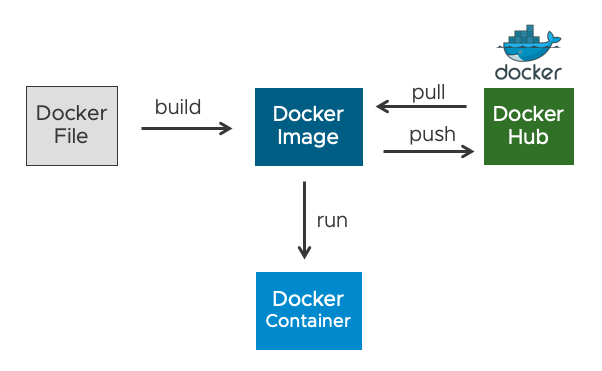
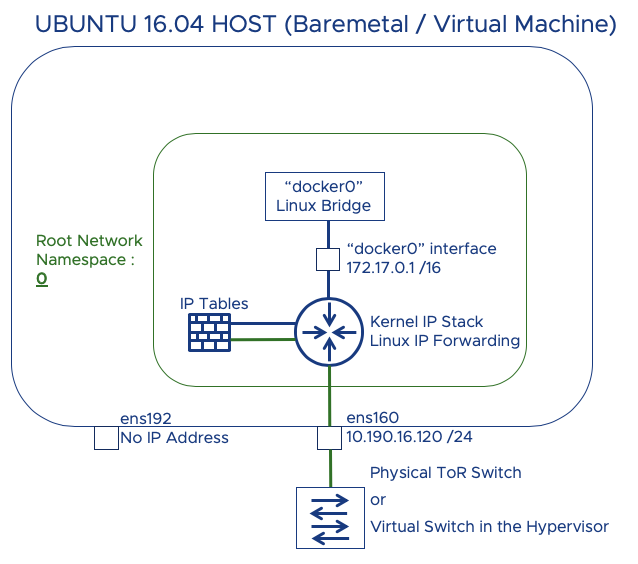
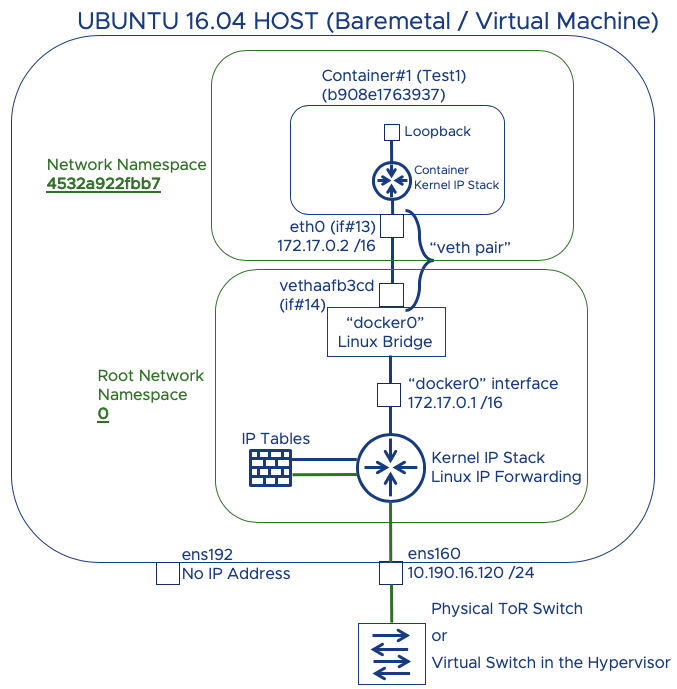
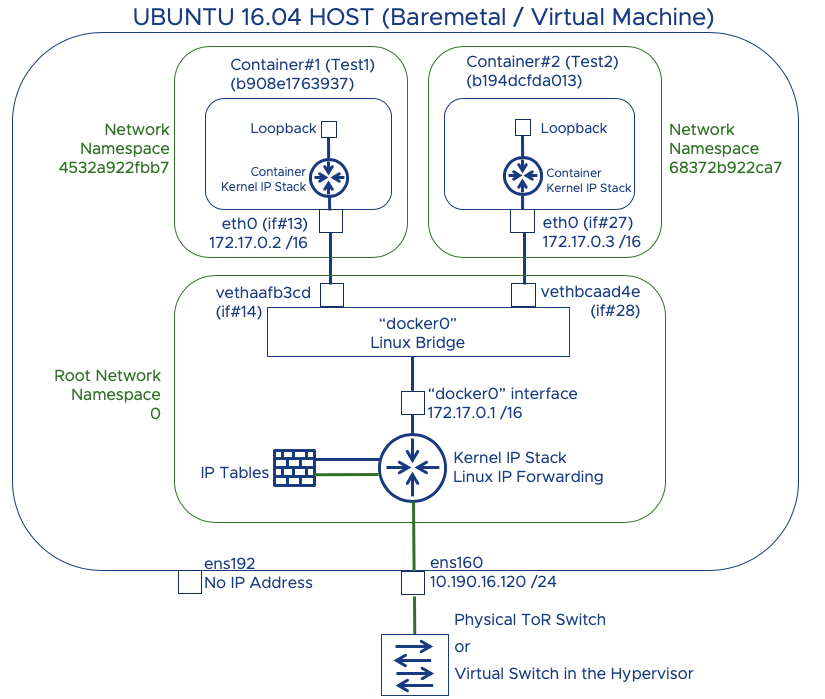
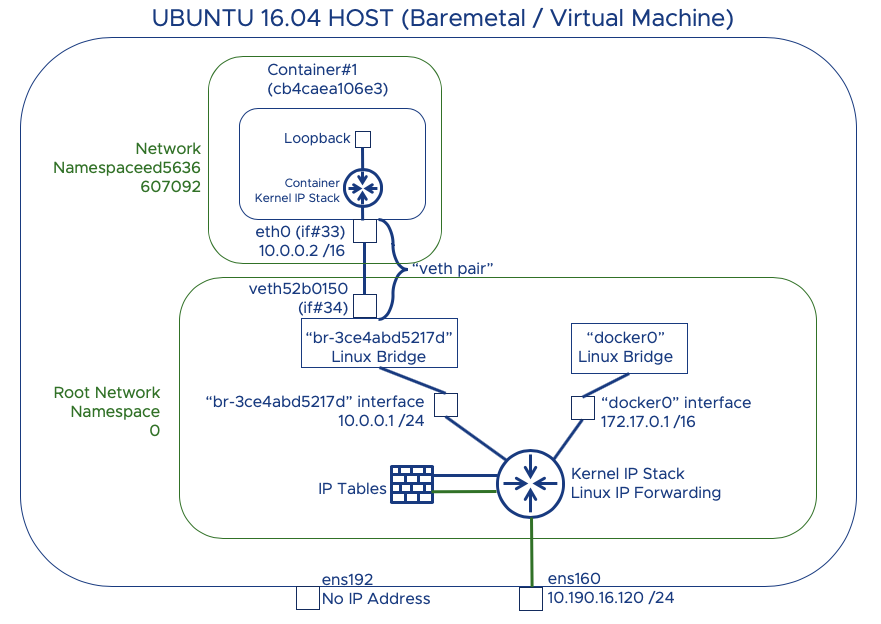

# Docker Networking

[toc]

# TL;DR

* Read this first: https://docs.docker.com/network/
  * [Standalone networking tutorial](https://docs.docker.com/network/network-tutorial-standalone/)
  * [Host networking tutorial](https://docs.docker.com/network/network-tutorial-host/)
  * [Overlay networking tutorial](https://docs.docker.com/network/network-tutorial-overlay/)
  * [Macvlan networking tutorial](https://docs.docker.com/network/network-tutorial-macvlan/)
* Detailed intro: https://dumlutimuralp.medium.com/docker-networking-intro-62d4bc163843
  * Why is docker0 down and all seems to be working OK?


# Docker and networking

Source: https://runnable.com/docker/basic-docker-networking

* `docker network ls`
* `docker network inspect <network-name>`

Networks can be configured to provide complete isolation for containers, which enable building web applications that work together *securely*.

## Default behavior

Docker creates three networks automatically on install: `bridge`, `none`, and `host`. Specify which network a container should use with the `--net` flag. If you create a new network `my_network` (more on this later), you can connect your container (`my_container`) with:

```
docker run my_container --net=my_network
```

### Bridge

All Docker installations represent the `docker0` network with `bridge`; Docker connects to `bridge` by default. Run `ifconfig` on the Linux host to view the `bridge` network.

When you run the following command in your console, Docker returns a JSON object describing the `bridge` network (including information regarding which containers run on the network, the options set, and listing the subnet and gateway).

```
docker network inspect bridge
```

Docker automatically creates a subnet and gateway for the `bridge` network, and `docker run` automatically adds containers to it. If you have containers running on your network, `docker network inspect` displays networking information for your containers.

Any containers on the same network may communicate with one another via IP addresses. Docker does not support automatic service discovery on `bridge`. You must connect containers with the `--link` option in your `docker run` command.

The Docker `bridge` supports port mappings and `docker run --link` allowing communications between containers on the `docker0` network. However, these error-prone techniques require unnecessary complexity. Just because you can use them, does not mean you *should*. It’s better to define your own networks instead.

### None

This offers a container-specific network stack that lacks a network interface. This container only has a local loopback interface (i.e., no external network interface).

### Host

This enables a container to attach to your host’s network (meaning the configuration *inside* the container **matches** the configuration *outside* the container).

### MACVLAN

See: https://www.youtube.com/watch?v=5grbXvV_DSk

* Here docker will assign first free address and conflict with a local DHCP server.
* Each IP address

```
docker network create -d macvlan
—subnet 192.168.0.0/24
—gateway 192.168.0.1
—ip-range 192.168.0.253/32
-o parent=enp6s0
```

### IPVLAN

See: https://www.youtube.com/watch?v=5grbXvV_DSk

* Only use one MAC address with several IPaddresses, mmm.

### Overlay network

* Used in docker-swarm, not relevant for Kubernetis

## Defining your own networks

You can create multiple networks with Docker and add containers to one or more networks. Containers can communicate within networks but not *across* networks. A container with attachments to multiple networks can connect with all of the containers on all of those networks. This lets you build a “hub” of sorts to connect to multiple networks and separate concerns.

### Creating a bridge network

Bridge networks (similar to the default `docker0` network) offer the easiest solution to creating your own Docker network. While similar, you do not simply clone the `default0` network, so you get some new features and lose some old ones. Follow along below to create your own `my_isolated_bridge_network` and run your Postgres container `my_psql_db` on that network:

```
$ docker network create --driver bridge my_isolated_bridge_network
3b7e1ad19ee8bec9628b18f9f3691adecd2ea3395ec248f8fa57a2ec85aa71c1
$ docker network inspect my_isolated_bridge_network
[
    {
        "Name": "my_isolated_bridge_network",
        "Id": "3b7e1ad19ee8bec9628b18f9f3691adecd2ea3395ec248f8fa57a2ec85aa71c1",
        "Scope": "local",
        "Driver": "bridge",
        "EnableIPv6": false,
        "IPAM": {
            "Driver": "default",
            "Options": {},
            "Config": [
                {
                    "Subnet": "172.18.0.0/16",
                    "Gateway": "172.18.0.1/16"
                }
            ]
        },
        "Internal": false,
        "Containers": {},
        "Options": {},
        "Labels": {}
    }
]
$ docker network ls
NETWORK ID          NAME                         DRIVER
fa1ff6106123        bridge                       bridge
803369ddc1ae        host                         host
3b7e1ad19ee8        my_isolated_bridge_network   bridge
01cc882aa43b        none                         null
$ docker run --net=my_isolated_bridge_network --name=my_psql_db postgres
$ docker network inspect my_isolated_brige_network
[
    {
        "Name": "my_isolated_bridge_network",
        "Id": "3b7e1ad19ee8bec9628b18f9f3691adecd2ea3395ec248f8fa57a2ec85aa71c1",
        "Scope": "local",
        "Driver": "bridge",
        "EnableIPv6": false,
        "IPAM": {
            "Driver": "default",
            "Options": {},
            "Config": [
                {
                    "Subnet": "172.18.0.0/16",
                    "Gateway": "172.18.0.1/16"
                }
            ]
        },
        "Internal": false,
        "Containers": {
            "b4ba8821a2fa3d602ebf2ff114b4dc4a9dbc178784dad340e78210a1318b717b": {
                "Name": "my_psql_db",
                "EndpointID": "4434c2c253afed44898aa6204a1ddd9b758ee66f7b5951d93ca2fc6dd610463c",
                "MacAddress": "02:42:ac:12:00:02",
                "IPv4Address": "172.18.0.2/16",
                "IPv6Address": ""
            }
        },
        "Options": {},
        "Labels": {}
    }
]
```

Any other container you create on this network can immediately connect to any other container on this network. The network isolates containers from other (including external) networks. However, you can expose and publish container ports on the network, allowing portions of your `bridge` access to an outside network.

### Creating an overlay network

If you want native multi-host networking, you need to create an overlay network. These networks require a valid key-value store service, such as Consul, Etcd, or ZooKeeper. You must install and configure your key-value store service **before** creating your network. Your Docker hosts (you can use multiple hosts with overlay networks) must communicate with the service you choose. Each host needs to run Docker. You can provision the hosts with Docker Machine.

Open the following ports between each of your hosts:

| Protocol | Port | Purpose |
| :------- | :--- | :------ |
| udp      | 4789 | data    |
| tcp/udp  | 7946 | control |

Check your key-value store service documentation; your service may need more ports open.

Create an overlay network by configuring options on each Docker daemon you wish to use with the network. You may set the following options:

| Option                                                       | Description                                                  |
| :----------------------------------------------------------- | :----------------------------------------------------------- |
| `--cluster-store=PROVIDER://URL`                             | Describes the location of the key-value store service        |
| `--cluster-advertise=HOST_IP` or `--cluster-advertise=HOST_IFACE:PORT` | The IP address or interface corresponding to the clustering host |
| `--cluster-store-opt=KEY-VALUE OPTIONS`                      | Additional options, like a TLS certificate                   |

1. Create the overlay network in a similar manner to the bridge network (network name `my_multi_host_network`):

   ```
    docker network create --driver overlay my_multi_host_network
   ```

2. Launch containers on each host; make sure you specify the network name:

   ```
    docker run -itd -net=my_multi_host_network my_python_app
   ```

Once you connect, every container on the network has access to all the other containers on the network, *regardless of the Docker host* serving the container.

## Further information

Normally when you detach from a container, the container stops. You can leave it running by pressing `CTRL-p + CTRL-q`.

The Linux `screen` tool might become your new best friend. You can use it to start containers in other “windows” (in your terminal) and jump between the action in one window and the next. Try out these really helpful commands:

| Command             | Description                                                  |
| :------------------ | :----------------------------------------------------------- |
| `screen -S my_name` | Creates a new screen called “my_name” (so you can later reference it by name rather than ID) |
| `screen -x`         | If you have only one screen open, jumps to that screen; if you have multiple screens open, lists available screens |
| `screen -x my_name` | Switches to screen with name `my_name`                       |

### None and Host

These have specific uses for the Docker installation. Do not bind containers to these networks.

### Custom Bridge Networks

Use bridge networks when you need a relatively small network on a single host. Containers you create on your custom bridge network must exist on the same host. Docker *does not* support linking on bridge networks you define.

### Custom Overlay Networks

You must *install and configure* your key-value store service (either Consul, Etcd, or ZooKeeper) **before** creating your network.

## Docker-compose and networking

Source: https://runnable.com/docker/docker-compose-networking

Docker Compose sets up a single network for your application(s) by default, adding each container for a service to the default network. Containers on a single network can reach and discover every other container on the network.

## Networking Basics

Running the command `docker network ls` will list out your current Docker networks; it should look similar to the following:

```
$ docker network ls
NETWORK ID          NAME                         DRIVER
17cc61328fef        bridge                       bridge
098520f7fce0        composedjango_default        bridge
1ce3c572afc6        composeflask_default         bridge
8fd07d456e6c        host                         host
3b578b919641        none                         null
```

You can alter the network name with the `-p` or `--project-name` flags or the `COMPOSE_PROJECT_NAME` environment variable. (In the event you need to run multiple projects on a single host, it’s recommended to set project names via the flag.)

In our `compose_django` example, `web` can access the PostgreSQL database from `postgres://postgres:5432`. We can access `web` from the outside world via port 8000 on the Docker host (only because the `web` service explicitly maps port 8000.

## Updating Containers on the Network

You can change service configurations via the Docker Compose file. When you run `docker-compose up` to update the containers, Compose removes the old container and inserts a new one. The new container has a different IP address than the old one, but *they have the same name*. Containers with open connections to the old container close those connections, look up the new container by its name, and connect.

## Linking Containers

You may define additional aliases that services can use to reach one another. *Services on the same network can already reach one another.* In the example below, we allow `web` to reach `db` via one of two hostnames (`db` or `database`):

```
version: '2'
services:
    web:
        build: . 
        links: 
            - "db:database"
    db:
        image: postgres
```

If you do not specify a second hostname (for example, `- db` instead of `- "db:database"`), Docker Compose uses the service name (`db`). Links express dependency like `depends_on` does, meaning links dictate the order of service startup.

## Networking with Multiple Hosts

You may use the `overlay` driver when deploying Docker Compose to a Swarm cluster. We’ll cover more on Docker Swarm in a future article.

## Configuring the Default Network

If you desire, you can configure the default network instead of (or in addition to) customizing your own network. Simply define a `default` entry under `networks`:

```
verision: '2'

services:
    web:
        build: . 
        ports:
            - "8000:8000"
    db:
        image: postgres

networks:
    default:
        driver: custom-driver-1
```

## Custom Networks

Specify your own networks with the top-level `networks` key, to allow creating more complex topologies and specify network drivers (and options). You can also use this configuration to connect services with external networks Docker Compose does not manage. Each service can specify which networks to connect to with its service-level `networks` key.

The following example defines two custom networks. Keep in mind, `proxy` *cannot* connect to `db`, as they do not share a network; however, `app` can connect to both. In the `front` network, we specify the IPv4 and IPv6 addresses to use (we have to configure an `ipam` block defining the `subnet` and `gateway` configurations). We could customize either network or neither one, but we do want to use separate drivers to separate the networks (review [Basic Networking with Docker](https://runnable.com/docker/basic-docker-networking) for a refresher):

```
version: '2'

services:
    proxy:
        build: ./proxy
        networks: 
            - front
    app:
        build: ./app
        networks:
            # you may set custom IP addresses
            front:
                ipv4_address: 172.16.238.10 
                ipv6_address: "2001:3984:3989::10"
            - back
    db:
        image: postgres
        networks:
            - back

networks:
    front:
        # use the bridge driver, but enable IPv6
        driver: bridge
        driver_opts:
            com.docker.network.enable_ipv6: "true"
        ipam:
            driver: default
            config:
                - subnet: 172.16.238.0/24
                gateway: 172.16.238.1
                - subnet: "2001:3984:3989::/64"
                gateway: "2001:3984:3989::1"
    back:
        # use a custom driver, with no options
        driver: custom-driver-1
```

## Pre-Existing Networks

You can even use pre-existing networks with Docker Compose; just use the `external` option:

```
version: '2'

networks:
    default:
        external:
            name: i-already-created-this
```

In this case, Docker Compose never creates the default network; instead connecting the app’s containers to the `i-already-created-this` network.

## Common Issues

You’ll need to use version 2 of the Compose file format. (If you follow along with these tutorials, you already do.) *Legacy (version 1) Compose files **do not** support networking.* You can determine the version from the `version:` line in the `docker-compose.yml` file.

### General YAML

Use quotes (“” or ‘’) whenever you have a colon (:) in your configuration values, to avoid confusion with key-value pairs.

### Updating Containers

Container IP addresses change on update. Reference containers by name, not IP, whenever possible. Otherwise you’ll need to update the IP address you use.

### Links

If you define both links and networks, linked services must share *at least one network* to communicate.

* Docker is the short version of "Dock Worker"
* The idea is to build better -> to ship better -> to deploy (run) better
* Components of Docker is written in Go or Golang
* Open Container Initiative : Standardize container format and runtime , vendor neutral, platform neutral (OCI operates under Linux Foundation)
* Containers provide scalable, self healing and portable apps

# Networking Tutorial

**Source:** https://dumlutimuralp.medium.com/docker-networking-intro-62d4bc163843

A single Ubuntu 16.04.5 LTS based virtual machine is used in this guide. It is configured with a static IP address. As shown below in Ubuntu's shell.

```
root@ubuntu26:~# more /etc/network/interfaces

source /etc/network/interfaces.d/*

auto lo
iface lo inet loopback
auto ens160
iface ens160 inet static
address 10.190.16.120
netmask 255.255.255.0
broadcast 10.190.16.255
gateway 10.190.16.1
dns-nameservers 192.168.1.185
root@ubuntu26:~#
```

* Escalate to root

```
vmware@ubuntu26:~$ 
vmware@ubuntu26:~$ sudo -H bash
root@ubuntu26:/home/vmware#
```

* Ensure the integrity and authenticity of the images that are downloaded from Docker Hub. GPG is based on Public Key Cryptogragphy (more info is [here](https://www.gnupg.org/))

```
root@ubuntu26:/home/vmware#curl -fsSL https://download.docker.com/linux/ubuntu/gpg | sudo apt-key add -
OK
```

* Configure Docker Hub as the APT source rather than the Ubuntu 16.04 repository

```
root@ubuntu26:/home/vmware# sudo add-apt-repository "deb [arch=amd64] https://download.docker.com/linux/ubuntu $(lsb_release -cs) stable"
root@ubuntu26:/home/vmware#
```

* Update Docker packages
* "apt-get update" basically downloads the package lists from the repositories and "updates" them to get information on the newest versions of packages and their dependencies.

```
root@ubuntu26:/home/vmware# apt-get update
Get:1 http://security.ubuntu.com/ubuntu xenial-security InRelease [109 kB]
Get:2 http://us.archive.ubuntu.com/ubuntu xenial InRelease [247 kB]
|
|
Output Omitted
|
|
Get:48 http://us.archive.ubuntu.com/ubuntu xenial-backports/universe Translation-en [4,184 B]
Fetched 30.0 MB in 9s (3,233 kB/s)
Reading package lists... Done
root@ubuntu26:/home/vmware#
```

* Make sure the repository for Docker is Docker repo rather than Ubuntu repo

```
root@ubuntu26:/home/vmware# apt-cache policy docker-ce
docker-ce:
  Installed: (none)
  Candidate: 5:18.09.6~3-0~ubuntu-xenial
  Version table:
     5:18.09.6~3-0~ubuntu-xenial 500
        500 https://download.docker.com/linux/ubuntu xenial/stable amd64 Packages
    |
    Output Omitted
    |
     17.03.0~ce-0~ubuntu-xenial 500
        500 https://download.docker.com/linux/ubuntu xenial/stable amd64 Packages
root@ubuntu26:/home/vmware# ^C
```

# Installation

[Back to Table of Contents](https://medium.com/@dumlutimuralp/docker-networking-intro-62d4bc163843#d66d)

* Install Docker

```
root@ubuntu26:/home/vmware# apt-get install -y docker-ce
Reading package lists... Done
Building dependency tree
Reading state information... Done
The following additional packages will be installed:
  aufs-tools cgroupfs-mount containerd.io docker-ce-cli libltdl7 pigz
Suggested packages:
  mountall
The following NEW packages will be installed:
  aufs-tools cgroupfs-mount containerd.io docker-ce docker-ce-cli libltdl7 pigz
0 upgraded, 7 newly installed, 0 to remove and 161 not upgraded.
Need to get 50.5 MB of archives.
After this operation, 243 MB of additional disk space will be used.
Get:1 http://us.archive.ubuntu.com/ubuntu xenial/universe amd64 pigz amd64 2.3.1-2 [61.1 kB]
Get:2 https://download.docker.com/linux/ubuntu xenial/stable amd64 containerd.io amd64 1.2.5-1 [19.9 MB]
Get:3 http://us.archive.ubuntu.com/ubuntu xenial/universe amd64 aufs-tools amd64 1:3.2+20130722-1.1ubuntu1 [92.9 kB]
Get:4 http://us.archive.ubuntu.com/ubuntu xenial/universe amd64 cgroupfs-mount all 1.2 [4,970 B]
Get:5 http://us.archive.ubuntu.com/ubuntu xenial/main amd64 libltdl7 amd64 2.4.6-0.1 [38.3 kB]
Get:6 https://download.docker.com/linux/ubuntu xenial/stable amd64 docker-ce-cli amd64 5:18.09.6~3-0~ubuntu-xenial [13.0 MB]
Get:7 https://download.docker.com/linux/ubuntu xenial/stable amd64 docker-ce amd64 5:18.09.6~3-0~ubuntu-xenial [17.4 MB]
Fetched 50.5 MB in 10s (4,785 kB/s)
Selecting previously unselected package pigz.
(Reading database ... 59693 files and directories currently installed.)
Preparing to unpack .../pigz_2.3.1-2_amd64.deb ...
|
|
Output Omitted
|
|
Setting up aufs-tools (1:3.2+20130722-1.1ubuntu1) ...
Setting up cgroupfs-mount (1.2) ...
Setting up containerd.io (1.2.5-1) ...
Setting up docker-ce-cli (5:18.09.6~3-0~ubuntu-xenial) ...
Setting up docker-ce (5:18.09.6~3-0~ubuntu-xenial) ...
update-alternatives: using /usr/bin/dockerd-ce to provide /usr/bin/dockerd (dockerd) in auto mode
Setting up libltdl7:amd64 (2.4.6-0.1) ...
Processing triggers for libc-bin (2.23-0ubuntu10) ...
Processing triggers for systemd (229-4ubuntu21.4) ...
Processing triggers for ureadahead (0.100.0-19) ...
root@ubuntu26:/home/vmware#
```

* Make sure Docker is running

```
root@ubuntu26:/home/vmware# systemctl status docker
● docker.service - Docker Application Container Engine
   Loaded: loaded (/lib/systemd/system/docker.service; enabled; vendor preset: enabled)
   Active: active (running) since Mon 2019-06-17 12:33:25 EDT; 3min 48s ago
     Docs: https://docs.docker.com
 Main PID: 3305 (dockerd)
   CGroup: /system.slice/docker.service
           └─3305 /usr/bin/dockerd -H fd:// --containerd=/run/containerd/containerd.sock

Jun 17 12:33:24 ubuntu26 dockerd[3305]: time="2019-06-17T12:33:24.322015384-04:00" level=warning msg="Your kernel does not support swap memory limit"
Jun 17 12:33:24 ubuntu26 dockerd[3305]: time="2019-06-17T12:33:24.322303782-04:00" level=warning msg="Your kernel does not support cgroup rt period"
Jun 17 12:33:24 ubuntu26 dockerd[3305]: time="2019-06-17T12:33:24.322529745-04:00" level=warning msg="Your kernel does not support cgroup rt runtime"
Jun 17 12:33:24 ubuntu26 dockerd[3305]: time="2019-06-17T12:33:24.323451458-04:00" level=info msg="Loading containers: start."
Jun 17 12:33:24 ubuntu26 dockerd[3305]: time="2019-06-17T12:33:24.867494590-04:00" level=info msg="Default bridge (docker0) is assigned with an IP address 172.17.0.0/16. Daemon option --bip
Jun 17 12:33:24 ubuntu26 dockerd[3305]: time="2019-06-17T12:33:24.944308261-04:00" level=info msg="Loading containers: done."
Jun 17 12:33:25 ubuntu26 dockerd[3305]: time="2019-06-17T12:33:25.012992693-04:00" level=info msg="Docker daemon" commit=481bc77 graphdriver(s)=overlay2 version=18.09.6
Jun 17 12:33:25 ubuntu26 dockerd[3305]: time="2019-06-17T12:33:25.013579127-04:00" level=info msg="Daemon has completed initialization"
Jun 17 12:33:25 ubuntu26 dockerd[3305]: time="2019-06-17T12:33:25.038175853-04:00" level=info msg="API listen on /var/run/docker.sock"
Jun 17 12:33:25 ubuntu26 systemd[1]: Started Docker Application Container Engine.
root@ubuntu26:/home/vmware#
```

As you may have already noticed in the output above, a default bridge is created with 172.17.0.0/16 subnet.

The first three error messages are about being able to put memory, CPU and swap limitations to containers. Means that the current Kernel version in Ubuntu 16.04 does not seem to support these features. More info [here](https://support.plesk.com/hc/en-us/articles/115004786934-Docker-service-shows-warnings-Your-kernel-does-not-support-cgroup-rt-runtime) and also [here](https://docs.docker.com/config/containers/resource_constraints/). It is ok as these features will not be used in this lab.

* Check the Docker version

```
dtimuralp-a02:Applications dtimuralp$ docker version
root@ubuntu26:/home/vmware# docker version
Client:
 Version:           18.09.6
 API version:       1.39
 Go version:        go1.10.8
 Git commit:        481bc77
 Built:             Sat May  4 02:35:27 2019
 OS/Arch:           linux/amd64
 Experimental:      false

Server: Docker Engine - Community
 Engine:
  Version:          18.09.6
  API version:      1.39 (minimum version 1.12)
  Go version:       go1.10.8
  Git commit:       481bc77
  Built:            Sat May  4 01:59:36 2019
  OS/Arch:          linux/amd64
  Experimental:     false
root@ubuntu26:/home/vmware#
```

The logic is Docker Client ===== API Calls ===> Docker Server (Daemon) ; both running on the Ubuntu OS. Hence there are two docker versions are shown in this output, one for client and one for server version.

# Docker Basics

[Back to Table of Contents](https://medium.com/@dumlutimuralp/docker-networking-intro-62d4bc163843#d66d)

* Check Docker information

```
root@ubuntu26:/home/vmware# docker info
Containers: 0
 Running: 0
 Paused: 0
 Stopped: 0
Images: 0
Server Version: 18.09.6
Storage Driver: overlay2
 Backing Filesystem: extfs
 Supports d_type: true
 Native Overlay Diff: true
Logging Driver: json-file
Cgroup Driver: cgroupfs
Plugins:
 Volume: local
Network: bridge host macvlan null overlay
 Log: awslogs fluentd gcplogs gelf journald json-file local logentries splunk syslog
Swarm: inactive
Runtimes: runc
Default Runtime: runc
Init Binary: docker-init
containerd version: bb71b10fd8f58240ca47fbb579b9d1028eea7c84
runc version: 2b18fe1d885ee5083ef9f0838fee39b62d653e30
init version: fec3683
Security Options:
 apparmor
 seccomp
  Profile: default
Kernel Version: 4.4.0-131-generic
Operating System: Ubuntu 16.04.5 LTS
OSType: linux
Architecture: x86_64
CPUs: 2
Total Memory: 3.859GiB
Name: ubuntu26
ID: 6CX6:X6JC:7QVT:KKOG:ZZO7:35XC:WLVZ:EK3Z:XD7J:CFID:CRNI:7OBA
Docker Root Dir: /var/lib/docker
Debug Mode (client): false
Debug Mode (server): false
Registry: https://index.docker.io/v1/
Labels:
Experimental: false
Insecure Registries:
 127.0.0.0/8
Live Restore Enabled: false
Product License: Community Engine

WARNING: No swap limit support
root@ubuntu26:/home/vmware#
```

Docker Swarm shows up as inactive cause I am going to use a single host for now. Swarm is Docker's own container orchestration solution.

**Note for curious ones :** Runc is the runtime container by Docker which is donated to the Open Container Project (OCP) . Containerd is the container runtime wrapper which has runc as a component in it. For more info please check [here](https://blog.docker.com/2015/06/runc/). There is also info about containerd and runc [here](https://blog.docker.com/2017/08/what-is-containerd-runtime/) and [here](https://stackoverflow.com/questions/41645665/how-containerd-compares-to-runc)

* Check whether if any containers run by default

```
root@ubuntu26:/home/vmware# docker ps
CONTAINER ID        IMAGE               COMMAND             CREATED             STATUS              PORTS               NAMES
root@ubuntu26:/home/vmware#
```

No containers running by default.

* Check whether if there is any container images in the local repository

```
root@ubuntu26:/home/vmware# docker images
REPOSITORY          TAG                 IMAGE ID            CREATED             SIZE
root@ubuntu26:/home/vmware#
```

No images in the local repository by default.

**Note :** Images can be interpreted as "stopped containers" (like VM Templates). Containers can be interpreted as "running images" (like a VM template turned into an actual VM).

Whenever you' d like to build or run a container you need to find and use a base image. Below figure helps to understand the overall picture.



# Docker Networking

[Back to Table of Contents](https://medium.com/@dumlutimuralp/docker-networking-intro-62d4bc163843#d66d)

Official Docker documentation on "Configuring Networking" can be found [here](https://docs.docker.com/network/)

Docker has various network drivers . Most popular ones are Bridge, Overlay and MACVLAN. [This article](https://blog.docker.com/2016/12/understanding-docker-networking-drivers-use-cases/) summarizes them well. In this guide we are focusing on "Bridge" network driver.

* Check which Docker networks are created by default :

```
root@ubuntu26:/home/vmware# docker network ls
NETWORK ID          NAME                DRIVER              SCOPE
8dc12dd156a0        bridge              bridge              local
f4238f561257        host                host                local
70c020e17c5e        none                null                local
root@ubuntu26:/home/vmware#
```

By default Docker (on Ubuntu OS) creates three networks as shown in the above output. Notice their driver types are bridge, host and none. Scope "local" means, single-host mode.

What Docker implements with network named as "bridge" is, a Linux bridge named as "docker0" . This will be verified on Ubuntu shell.

* Inspect the Docker network "bridge" config ("docker network inspect < Docker NETWORK NAME > / OR / < Docker NETWORK ID >)

```
root@ubuntu26:/home/vmware# docker network inspect bridge
[
    {
        "Name": "bridge",
        "Id": "8dc12dd156a08710bd4f6bbb384de6e803d942854b28e84c35f89ee9db75497f",
        "Created": "2019-06-17T12:33:24.867585642-04:00",
        "Scope": "local",
        "Driver": "bridge",
        "EnableIPv6": false,
        "IPAM": {
            "Driver": "default",
            "Options": null,
            "Config": [
                {
                    "Subnet": "172.17.0.0/16"
                }
            ]
        },
        "Internal": false,
        "Attachable": false,
        "Ingress": false,
        "ConfigFrom": {
            "Network": ""
        },
        "ConfigOnly": false,
        "Containers": {},
        "Options": {
            "com.docker.network.bridge.default_bridge": "true",
            "com.docker.network.bridge.enable_icc": "true",
            "com.docker.network.bridge.enable_ip_masquerade": "true",
            "com.docker.network.bridge.host_binding_ipv4": "0.0.0.0",
            "com.docker.network.bridge.name": "docker0",
            "com.docker.network.driver.mtu": "1500"
        },
        "Labels": {}
    }
]
root@ubuntu26:/home/vmware#
```

**ID** the first couple of characters in the ID field matches the NETWORK ID shown in "docker network ls" output.

**IPAM => Config => Subnet** is configured as 172.16.0.0/16. Which means, Docker will assign an IP address from this subnet to every container connected to this Docker network.

**enable_icc:true** means that inter container communication is allowed on this Docker network.

**enable_ip_masquerade: true** means that "iptables" rules will be modified on this host to apply SNAT (source NAT) for all the containers connected to this Docker network. Docker manipulates "iptables" rules on the host (Ubuntu virtual machine) to provide network isolation for containers from the external network. IPtables will be explained in a seperate article. More info on this in official Docker documentation is [here](https://docs.docker.com/network/iptables/)

**bridge name : docker0** Notice that the bridge name is "docker0" . This is the name assigned to the Linux bridge which is configured and managed by Docker.

* Let' s examine the Linux bridge on Ubuntu shell. To do that "bridge-utils" package needs to be installed.

```
root@ubuntu26:/home/vmware# apt-get install bridge-utils
Reading package lists... Done
Building dependency tree
Reading state information... Done
The following NEW packages will be installed:
  bridge-utils
0 upgraded, 1 newly installed, 0 to remove and 161 not upgraded.
Need to get 28.6 kB of archives.
After this operation, 102 kB of additional disk space will be used.
Get:1 http://us.archive.ubuntu.com/ubuntu xenial/main amd64 bridge-utils amd64 1.5-9ubuntu1 [28.6 kB]
Fetched 28.6 kB in 0s (31.3 kB/s)
Selecting previously unselected package bridge-utils.
(Reading database ... 59983 files and directories currently installed.)
Preparing to unpack .../bridge-utils_1.5-9ubuntu1_amd64.deb ...
Unpacking bridge-utils (1.5-9ubuntu1) ...
Processing triggers for man-db (2.7.5-1) ...
Setting up bridge-utils (1.5-9ubuntu1) ...
root@ubuntu26:/home/vmware#
```

* Let' s check the bridge information from the Linux bridge commands which all start with "brctl"

```
root@ubuntu26:/home/vmware# brctl show
bridge name     bridge id               STP enabled     interfaces
docker0         8000.0242ed408e96       no
root@ubuntu26:/home/vmware#
```

Remember "docker0" is the name of the Linux bridge. This Linux bridge is being used by the Docker network named as "bridge" ("docker network ls" output)

* Let' s check the link layer state of the interfaces on Ubuntu

```
root@ubuntu26:/home/vmware# ip link show
1: lo:  mtu 65536 qdisc noqueue state UNKNOWN mode DEFAULT group default qlen 1
    link/loopback 00:00:00:00:00:00 brd 00:00:00:00:00:00
2: ens160:  mtu 1500 qdisc mq state UP mode DEFAULT group default qlen 1000
    link/ether 00:50:56:b4:47:61 brd ff:ff:ff:ff:ff:ff
3: ens192:  mtu 1500 qdisc noop state DOWN mode DEFAULT group default qlen 1000
    link/ether 00:50:56:b4:9b:ec brd ff:ff:ff:ff:ff:ff
4: docker0:  mtu 1500 qdisc noqueue state DOWN mode DEFAULT group default
    link/ether 02:42:ed:40:8e:96 brd ff:ff:ff:ff:ff:ff
root@ubuntu26:/home/vmware#
```

**Notice docker0 interface is down.**

* Let' s check the network layer state of the interfaces on Ubuntu

```
root@ubuntu26:/home/vmware# ip address show
1: lo:  mtu 65536 qdisc noqueue state UNKNOWN group default qlen 1
    link/loopback 00:00:00:00:00:00 brd 00:00:00:00:00:00
    inet 127.0.0.1/8 scope host lo
       valid_lft forever preferred_lft forever
    inet6 ::1/128 scope host
       valid_lft forever preferred_lft forever
2: ens160:  mtu 1500 qdisc mq state UP group default qlen 1000
    link/ether 00:50:56:b4:47:61 brd ff:ff:ff:ff:ff:ff
    inet 10.190.16.120/24 brd 10.190.16.255 scope global ens160
       valid_lft forever preferred_lft forever
    inet6 fe80::250:56ff:feb4:4761/64 scope link
       valid_lft forever preferred_lft forever
3: ens192:  mtu 1500 qdisc noop state DOWN group default qlen 1000
    link/ether 00:50:56:b4:9b:ec brd ff:ff:ff:ff:ff:ff
4: docker0:  mtu 1500 qdisc noqueue state DOWN group default
    link/ether 02:42:ed:40:8e:96 brd ff:ff:ff:ff:ff:ff
    inet 172.17.0.1/16 brd 172.17.255.255 scope global docker0
       valid_lft forever preferred_lft forever
    inet6 fe80::42:edff:fe40:8e96/64 scope link
       valid_lft forever preferred_lft forever
root@ubuntu26:/home/vmware#
```

ens160 is the first NIC of the Ubuntu OS, ens192 is the second NIC. ens192 is not used in this lab hence it does not have an IP address configured.

* Let' s check the routing table on Ubuntu

```
root@ubuntu26:/home/vmware# ip route show
default via 10.190.16.1 dev ens160 onlink
10.190.16.0/24 dev ens160  proto kernel  scope link  src 10.190.16.120
172.17.0.0/16 dev docker0  proto kernel  scope link  src 172.17.0.1 linkdown
root@ubuntu26:/home/vmware#
```

# Connectivity

[Back to Table of Contents](https://medium.com/@dumlutimuralp/docker-networking-intro-62d4bc163843#d66d)

At this stage, the connectivity diagram in the Ubuntu host is shown below.



There is a new term mentioned in this diagram, "network namespace". The easiest analogy to use for network namespace is VRF (Virtual Routing Forwarding) instances on an ordinary router in the routing & switching world. Although there are a few slight differences in between, in Linux, network namespaces are used for isolating network domains from each other. [Here](https://docs.openstack.org/neutron/pike/admin/intro-network-namespaces.html) is a good definition of it. [This is](https://blogs.igalia.com/dpino/2016/04/10/network-namespaces/) a good blog article on practical usage. Network namespaces become relevant in the case of containers and it will be explained in the next section.

The way root network namespace id can be identified is by using the ip netns list-id command shown below.

```
root@ubuntu26:/home/vmware# ip netns list-id
nsid 0
root@ubuntu26:/home/vmware#
```

# Linux Bridge

As mentioned a few times already, when Docker is installed, what Docker actually does is creating a Linux bridge named as "docker0". This also creates a new interface in Linux IP stack. This is native Linux bridge logic. Nothing specific. All Docker does is using Linux networking features at the backend.

In fact all this can easily be tested by manually creating a test Linux bridge and by verifying as shown below.

* Create a Linux test bridge

```
root@ubuntu26:/home/vmware# brctl addbr testbridge
root@ubuntu26:/home/vmware# brctl show
bridge name     bridge id               STP enabled     interfaces
docker0         8000.0242ed408e96       no              
testbridge              8000.000000000000       no
```

* Verify the new interface in Linux IP stack

```
root@ubuntu26:/home/vmware# ip link show
1: lo:  mtu 65536 qdisc noqueue state UNKNOWN mode DEFAULT group default qlen 1
    link/loopback 00:00:00:00:00:00 brd 00:00:00:00:00:00
2: ens160:  mtu 1500 qdisc mq state UP mode DEFAULT group default qlen 1000
    link/ether 00:50:56:b4:47:61 brd ff:ff:ff:ff:ff:ff
3: ens192:  mtu 1500 qdisc noop state DOWN mode DEFAULT group default qlen 1000
    link/ether 00:50:56:b4:9b:ec brd ff:ff:ff:ff:ff:ff
4: docker0:  mtu 1500 qdisc noqueue state DOWN mode DEFAULT group default
    link/ether 02:42:ed:40:8e:96 brd ff:ff:ff:ff:ff:ff
5: testbridge:  mtu 1500 qdisc noop state DOWN mode DEFAULT group default qlen 1000
    link/ether 62:bc:ca:07:1d:37 brd ff:ff:ff:ff:ff:ff
```

* Assign an IP address to the interface

```
root@ubuntu26:/home/vmware# ip addr add 10.10.10.1/24 dev testbridgeroot@ubuntu26:/home/vmware# ip address show
1: lo:  mtu 65536 qdisc noqueue state UNKNOWN group default qlen 1
    link/loopback 00:00:00:00:00:00 brd 00:00:00:00:00:00
    inet 127.0.0.1/8 scope host lo
       valid_lft forever preferred_lft forever
    inet6 ::1/128 scope host
       valid_lft forever preferred_lft forever
2: ens160:  mtu 1500 qdisc mq state UP group default qlen 1000
    link/ether 00:50:56:b4:47:61 brd ff:ff:ff:ff:ff:ff
    inet 10.190.16.120/24 brd 10.190.16.255 scope global ens160
       valid_lft forever preferred_lft forever
    inet6 fe80::250:56ff:feb4:4761/64 scope link
       valid_lft forever preferred_lft forever
3: ens192:  mtu 1500 qdisc noop state DOWN group default qlen 1000
    link/ether 00:50:56:b4:9b:ec brd ff:ff:ff:ff:ff:ff
4: docker0:  mtu 1500 qdisc noqueue state DOWN group default
    link/ether 02:42:ed:40:8e:96 brd ff:ff:ff:ff:ff:ff
    inet 172.17.0.1/16 brd 172.17.255.255 scope global docker0
       valid_lft forever preferred_lft forever
    inet6 fe80::42:edff:fe40:8e96/64 scope link
       valid_lft forever preferred_lft forever
5: testbridge:  mtu 1500 qdisc noop state DOWN group default qlen 1000
    link/ether 62:bc:ca:07:1d:37 brd ff:ff:ff:ff:ff:ff
    inet 10.10.10.1/24 scope global testbridge
       valid_lft forever preferred_lft forever
```

* Delete the Linux test bridge

```
root@ubuntu26:/home/vmware# brctl delbr testbridge
root@ubuntu26:/home/vmware# brctl show
bridge name     bridge id               STP enabled     interfaces
docker0         8000.0242ed408e96       no
```

# Creating containers

[Back to Table of Contents](https://medium.com/@dumlutimuralp/docker-networking-intro-62d4bc163843#d66d)

Docker uses various Linux namespace technologies for isolation. (ie user namespace, process namespace, etc.) For networking, it uses Linux network namespaces. Each container runs in its own Linux network namespace which means it has its own IP address, routing table, etc. Docker creates the content related to each network namespace here on Ubuntu => ***/var/run/docker/netns/\***

Note : This is different than checking network namespaces that are created directly through Linux (which can be investigated by **"ip netns list"** command. Something I learned the hardway.) Cause Docker created network namespaces are under the specific Docker folder mentioned above. [This thread](https://stackoverflow.com/questions/31265993/docker-networking-namespace-not-visible-in-ip-netns-list) explains the whole details quite well.

* Let' s create a container and see how docker0 bridge, interface connections and other things change

```
root@ubuntu26:/home/vmware# docker run -d --name test1 dumlutimuralp/networktest
Unable to find image 'dumlutimuralp/networktest:latest' locally
latest: Pulling from dumlutimuralp/networktest
357ea8c3d80b: Pull complete
|
|
Output Omitted
|
|
74525030d7c5: Pull complete
Digest: sha256:9e1ab3bffe246ec101e6a3cefa012c480035b5518225b108e47faa424d062ca3
Status: Downloaded newer image for dumlutimuralp/networktest:latest
b908e176393711f48e6e425526b2858e428711ce364ada295be9b769739ddfa2
```

**"docker run"** is the Docker command to pull a Docker image and then run it with the parameters provided.

**"-d"** means run this container in detached mode so that it can run in the background (not foreground, aka the terminal, which runs the shell) More info [here](https://docs.docker.com/engine/reference/run/#detached-vs-foreground) and [here](https://subscription.packtpub.com/book/networking_and_servers/9781784392826/6/ch06lvl1sec61/running-a-container-in-detached-mode)

**--name** is used to assign a name to this container, "Test1" is given as the container name in this example

**dumlutimuralp/networktest** is the location and the name of the Docker image to be used to create the container from (Since this image does not exist locally, Docker pulls the image from Docker Hub. I have a repository in Docker hub and the Docker image name is networktest)

* Let' s check the status of the container

```
root@ubuntu26:/home/vmware# docker ps
CONTAINER ID        IMAGE                       COMMAND                  CREATED             STATUS              PORTS               NAMES
b908e1763937        dumlutimuralp/networktest   "/docker-entrypoint.…"   10 seconds ago      Up 8 seconds        80/tcp, 443/tcp     test1
```

* Let' s check what has changed on the Linux bridge

```
root@ubuntu26:/home/vmware# brctl show
bridge name     bridge id               STP enabled     interfaces
docker0         8000.0242ed408e96       no              vethaafb3cd
root@ubuntu26:/home/vmware#
```

Nice. We got a new interface attached to the bridge. (vethaafb3cd) Notice that when creating the container in the previous step we did not specify any specific Docker network to connect the container to. Docker network "bridge" is selected by default.

* Let' s check how the IP interfaces have changed on Ubuntu

```
root@ubuntu26:/home/vmware# ip link show
1: lo:  mtu 65536 qdisc noqueue state UNKNOWN mode DEFAULT group default qlen 1
    link/loopback 00:00:00:00:00:00 brd 00:00:00:00:00:00
2: ens160:  mtu 1500 qdisc mq state UP mode DEFAULT group default qlen 1000
    link/ether 00:50:56:b4:47:61 brd ff:ff:ff:ff:ff:ff
3: ens192:  mtu 1500 qdisc noop state DOWN mode DEFAULT group default qlen 1000
    link/ether 00:50:56:b4:9b:ec brd ff:ff:ff:ff:ff:ff
4: docker0:  mtu 1500 qdisc noqueue state UP mode DEFAULT group default
    link/ether 02:42:ed:40:8e:96 brd ff:ff:ff:ff:ff:ff
14: vethaafb3cd@if13:  mtu 1500 qdisc noqueue master docker0 state UP mode DEFAULT group default
    link/ether a2:cf:f6:c2:96:79 brd ff:ff:ff:ff:ff:ff link-netnsid 0
root@ubuntu26:/home/vmware#
```

A few interesting things in the above output :

The **docker0 interface** has now changed its state to **"UP"**.

**"vethaafb3cd"** interface shows up in IP interface output of the Ubuntu host and its index is **#14** and this "vethaafb3cd" interface has an expression **"if13"** at the end. The master for this **"vethaafb3cd"** interface seems to be **"docker0"**. The other thing is there is an expression at the end **"link-netnsid 0"**.

* Let' s check the current network namespace list on Ubuntu

```
root@ubuntu26:/home/vmware# ls /var/run/docker/netns
4532a922fbb7
root@ubuntu26:/home/vmware#
```

Hmmm..There is a new network namespace. Could it be the one that the recently created container is in ?

* Let' s inspect the container that we just created

```
root@ubuntu26:/home/vmware# docker ps
CONTAINER ID        IMAGE                       COMMAND                  CREATED             STATUS              PORTS               NAMES
b908e1763937        dumlutimuralp/networktest   "/docker-entrypoint.…"   About an hour ago   Up About an hour    80/tcp, 443/tcp     test1
root@ubuntu26:/home/vmware#
root@ubuntu26:/home/vmware#
root@ubuntu26:/home/vmware# docker inspect b908e1763937
[
    {
        "Id": "b908e176393711f48e6e425526b2858e428711ce364ada295be9b769739ddfa2",
        "Created": "2019-06-18T12:39:59.599260556Z",
        "Path": "/docker-entrypoint.sh",
        "Args": [],
        "State": {
            "Status": "running",
            "Running": true,
            "Paused": false,
            "Restarting": false,
            "OOMKilled": false,
            "Dead": false,
            "Pid": 6861,
            "ExitCode": 0,
            "Error": "",
            "StartedAt": "2019-06-18T12:40:01.033430219Z",
            "FinishedAt": "0001-01-01T00:00:00Z"
        },
        "Image": "sha256:f06aa1d7d63a447137e7f8aa41945a707659afc5c531e639672e3477cb300499",
        "ResolvConfPath": "/var/lib/docker/containers/b908e176393711f48e6e425526b2858e428711ce364ada295be9b769739ddfa2/resolv.conf",
        "HostnamePath": "/var/lib/docker/containers/b908e176393711f48e6e425526b2858e428711ce364ada295be9b769739ddfa2/hostname",
        "HostsPath": "/var/lib/docker/containers/b908e176393711f48e6e425526b2858e428711ce364ada295be9b769739ddfa2/hosts",
        "LogPath": "/var/lib/docker/containers/b908e176393711f48e6e425526b2858e428711ce364ada295be9b769739ddfa2/b908e176393711f48e6e425526b2858e428711ce364ada295be9b769739ddfa2-json.log",
        "Name": "/test1",
       |
       |
       |
       Output Omitted
       |
       |
       |
        "NetworkSettings": {
            "Bridge": "",
            "SandboxID": "4532a922fbb7ca920b42d7ce99c3b78d12cecfa4c53ff6b631f02b2722ac288b",
            "HairpinMode": false,
            "LinkLocalIPv6Address": "",
            "LinkLocalIPv6PrefixLen": 0,
            "Ports": {
                "443/tcp": null,
                "80/tcp": null
            },
            "SandboxKey": "/var/run/docker/netns/4532a922fbb7",
            "SecondaryIPAddresses": null,
            "SecondaryIPv6Addresses": null,
            "EndpointID": "1b12b1e5001cc0d33c9e6c2083599519b7c4c75d2364946f1d3fe25c4b7bca33",
            "Gateway": "172.17.0.1",
            "GlobalIPv6Address": "",
            "GlobalIPv6PrefixLen": 0,
            "IPAddress": "172.17.0.2",
            "IPPrefixLen": 16,
            "IPv6Gateway": "",
            "MacAddress": "02:42:ac:11:00:02",
            "Networks": {
                "bridge": {
                    "IPAMConfig": null,
                    "Links": null,
                    "Aliases": null,
                    "NetworkID": "8dc12dd156a08710bd4f6bbb384de6e803d942854b28e84c35f89ee9db75497f",
                    "EndpointID": "1b12b1e5001cc0d33c9e6c2083599519b7c4c75d2364946f1d3fe25c4b7bca33",
                    "Gateway": "172.17.0.1",
                    "IPAddress": "172.17.0.2",
                    "IPPrefixLen": 16,
                    "IPv6Gateway": "",
                    "GlobalIPv6Address": "",
                    "GlobalIPv6PrefixLen": 0,
                    "MacAddress": "02:42:ac:11:00:02",
                    "DriverOpts": null
                }
            }
        }
    }
]
root@ubuntu26:/home/vmware#
```

So based on the output above, the container has an IP address of **"172.17.0.2"** , its network namespace is created with an ID of **"4532a922fbb7"** .

* Let' s check the IP interfaces in the container's network namespace. We can do this this from Ubuntu shell as shown below

```
root@ubuntu26:/home/vmware# nsenter --net=/var/run/docker/netns/4532a922fbb7 ip address show
1: lo:  mtu 65536 qdisc noqueue state UNKNOWN group default qlen 1
    link/loopback 00:00:00:00:00:00 brd 00:00:00:00:00:00
    inet 127.0.0.1/8 scope host lo
       valid_lft forever preferred_lft forever
13: eth0@if14:  mtu 1500 qdisc noqueue state UP group default
    link/ether 02:42:ac:11:00:02 brd ff:ff:ff:ff:ff:ff link-netnsid 0
    inet 172.17.0.2/16 brd 172.17.255.255 scope global eth0
       valid_lft forever preferred_lft forever
root@ubuntu26:/home/vmware#
```

In the above output, **#13** is the interface ID in the container itself, **#14** is the interface ID on the other end; and that other end is Ubuntu host itself.

**The connection between eth0 (Interface ID#13) in root network namespace (netnsid : 0) and vethaafb3cd (Interface ID#14) in container network namespace (netnsid :4532a922fbb7) is called "veth Pair".**

**A container gets connected to the root network namespace through a connection called "veth pair" and the container has its own network namespace.**

* Let' s check the IP route table in the container' s network namespace.

```
root@ubuntu26:/home/vmware# nsenter --net=/var/run/docker/netns/4532a922fbb7 ip route show
default via 172.17.0.1 dev eth0
172.17.0.0/16 dev eth0 proto kernel scope link src 172.17.0.2
```

* There is another way to verify this, which is more or less brings the same output in the previous step, but directly from the container network namespace itself

```
root@ubuntu26:/home/vmware# docker exec -it b908e1763937 bash
bash-4.4# ip address show
1: lo:  mtu 65536 qdisc noqueue state UNKNOWN group default qlen 1
    link/loopback 00:00:00:00:00:00 brd 00:00:00:00:00:00
    inet 127.0.0.1/8 scope host lo
       valid_lft forever preferred_lft forever
13: eth0@if14:  mtu 1500 qdisc noqueue state UP group default
    link/ether 02:42:ac:11:00:02 brd ff:ff:ff:ff:ff:ff link-netnsid 0
    inet 172.17.0.2/16 brd 172.17.255.255 scope global eth0
       valid_lft forever preferred_lft forever
bash-4.4#ip route show
default via 172.17.0.1 dev eth0
172.17.0.0/16 dev eth0 proto kernel scope link src 172.17.0.2
```

In the above command

"-t" is for connecting to the terminal inside that container "-i" stands for interactive, since we are using the shell for executing the commands in the container itself

* Below is the current connectivity



Let' s inspect the default Docker network "bridge"

```
root@ubuntu26:/home/vmware# docker network inspect bridge
[
    {
        "Name": "bridge",
        "Id": "8dc12dd156a08710bd4f6bbb384de6e803d942854b28e84c35f89ee9db75497f",
        "Created": "2019-06-17T12:33:24.867585642-04:00",
        "Scope": "local",
        "Driver": "bridge",
        "EnableIPv6": false,
        "IPAM": {
            "Driver": "default",
            "Options": null,
            "Config": [
                {
                    "Subnet": "172.17.0.0/16"
                }
            ]
        },
        "Internal": false,
        "Attachable": false,
        "Ingress": false,
        "ConfigFrom": {
            "Network": ""
        },
        "ConfigOnly": false,
        "Containers": {
            "b908e176393711f48e6e425526b2858e428711ce364ada295be9b769739ddfa2": {
                "Name": "test1",
                "EndpointID": "1b12b1e5001cc0d33c9e6c2083599519b7c4c75d2364946f1d3fe25c4b7bca33",
                "MacAddress": "02:42:ac:11:00:02",
                "IPv4Address": "172.17.0.2/16",
                "IPv6Address": ""
            }
        },
        "Options": {
            "com.docker.network.bridge.default_bridge": "true",
            "com.docker.network.bridge.enable_icc": "true",
            "com.docker.network.bridge.enable_ip_masquerade": "true",
            "com.docker.network.bridge.host_binding_ipv4": "0.0.0.0",
            "com.docker.network.bridge.name": "docker0",
            "com.docker.network.driver.mtu": "1500"
        },
        "Labels": {}
    }
]
root@ubuntu26:/home/vmware#
```

Notice that the "Containers" section in the output above is now populated with the "Test1" container' s information.

* Let' s create another container from the same Docker image

```
root@ubuntu26:/home/vmware# docker run -d --name test2 dumlutimuralp/networktest
b194dcfda013843fa5752715cc188ab21af8dca3939210675145dbc55ce67f7e
root@ubuntu26:/home/vmware# docker ps
CONTAINER ID        IMAGE                       COMMAND                  CREATED             STATUS              PORTS               NAMES
b194dcfda013        dumlutimuralp/networktest   "/docker-entrypoint.…"   11 seconds ago      Up 8 seconds        80/tcp, 443/tcp     test2
b908e1763937        dumlutimuralp/networktest   "/docker-entrypoint.…"   10 minutes ago      Up 10 minutes       80/tcp, 443/tcp     test1
root@ubuntu26:/home/vmware#
```

* Let' s check the network namespaces on Ubuntu

```
root@ubuntu26:/home/vmware# ls /var/run/docker/netns
68372b922ca7
4532a922fbb7
root@ubuntu26:/home/vmware#
```

Notice that there is a new network namespace created since we have created the second container.

* Let' s inspect the Docker network "bridge" once again

```
root@ubuntu26:/home/vmware# docker network inspect bridge
[
    {
        "Name": "bridge",
        "Id": "8dc12dd156a08710bd4f6bbb384de6e803d942854b28e84c35f89ee9db75497f",
        "Created": "2019-06-17T12:33:24.867585642-04:00",
        "Scope": "local",
        "Driver": "bridge",
        "EnableIPv6": false,
        "IPAM": {
            "Driver": "default",
            "Options": null,
            "Config": [
                {
                    "Subnet": "172.17.0.0/16"
                }
            ]
        },
        "Internal": false,
        "Attachable": false,
        "Ingress": false,
        "ConfigFrom": {
            "Network": ""
        },
        "ConfigOnly": false,
        "Containers": {
            "b194dcfda013843fa5752715cc188ab21af8dca3939210675145dbc55ce67f7e": {
                "Name": "test2",
                "EndpointID": "9e682ad8687c1b15f149f0c0e14ed8f36b10022fe335d27b1b774f13daf1de0a",
                "MacAddress": "02:42:ac:11:00:03",
                "IPv4Address": "172.17.0.3/16",
                "IPv6Address": ""
            },
            "b908e176393711f48e6e425526b2858e428711ce364ada295be9b769739ddfa2": {
                "Name": "test1",
                "EndpointID": "1b12b1e5001cc0d33c9e6c2083599519b7c4c75d2364946f1d3fe25c4b7bca33",
                "MacAddress": "02:42:ac:11:00:02",
                "IPv4Address": "172.17.0.2/16",
                "IPv6Address": ""
            }
        },
        "Options": {
            "com.docker.network.bridge.default_bridge": "true",
            "com.docker.network.bridge.enable_icc": "true",
            "com.docker.network.bridge.enable_ip_masquerade": "true",
            "com.docker.network.bridge.host_binding_ipv4": "0.0.0.0",
            "com.docker.network.bridge.name": "docker0",
            "com.docker.network.driver.mtu": "1500"
        },
        "Labels": {}
    }
]
root@ubuntu26:/home/vmware#
```

There are two entries in "Containers" section, shown above.

* The current connectivity looks like below



Let' s check inter container connectivity (Test1 Container -> Test 2 Container ICMP traffic)

```
root@ubuntu26:/home/vmware# docker exec -it b908e1763937 bash
bash-4.4# ping 172.17.0.3
PING 172.17.0.3 (172.17.0.3) 56(84) bytes of data.
64 bytes from 172.17.0.3: icmp_seq=1 ttl=64 time=4.63 ms
64 bytes from 172.17.0.3: icmp_seq=2 ttl=64 time=0.076 ms
64 bytes from 172.17.0.3: icmp_seq=3 ttl=64 time=0.088 ms
64 bytes from 172.17.0.3: icmp_seq=4 ttl=64 time=0.085 ms
64 bytes from 172.17.0.3: icmp_seq=5 ttl=64 time=0.072 ms
64 bytes from 172.17.0.3: icmp_seq=6 ttl=64 time=0.070 ms
^C
--- 172.17.0.3 ping statistics ---
6 packets transmitted, 6 received, 0% packet loss, time 5000ms
rtt min/avg/max/mdev = 0.070/0.837/4.634/1.698 ms
bash-4.4#exit
root@ubuntu26:/home/vmware#
```

* Let' s delete the containers

```
root@ubuntu26:/home/vmware# docker ps
CONTAINER ID        IMAGE                       COMMAND                  CREATED             STATUS              PORTS               NAMES
b194dcfda013        dumlutimuralp/networktest   "/docker-entrypoint.…"   2 minutes ago       Up 82 minutes       80/tcp, 443/tcp     test2
b908e1763937        dumlutimuralp/networktest   "/docker-entrypoint.…"   20 minutes ago      Up 20 minutes       80/tcp, 443/tcp     test1
root@ubuntu26:/home/vmware#root@ubuntu26:/home/vmware# docker rm b194dcfda013
Error response from daemon: You cannot remove a running container b194dcfda013843fa5752715cc188ab21af8dca3939210675145dbc55ce67f7e. Stop the container before attempting removal or force remove
root@ubuntu26:/home/vmware#
```

As you can see above you can not delete a container without stopping it.

```
root@ubuntu26:/home/vmware# docker stop b194dcfda013
docker stop b908e1763937b194dcfda013
root@ubuntu26:/home/vmware# docker stop b908e1763937
docker rm b194dcfda013b908e1763937
root@ubuntu26:/home/vmware# docker rm b194dcfda013
b194dcfda013
root@ubuntu26:/home/vmware# docker rm b908e1763937
b908e1763937
root@ubuntu26:/home/vmware# docker ps
CONTAINER ID        IMAGE               COMMAND             CREATED             STATUS              PORTS               NAMES
root@ubuntu26:/home/vmware#
```

# Creating a Docker Bridge Network

[Back to Table of Contents](https://medium.com/@dumlutimuralp/docker-networking-intro-62d4bc163843#d66d)

* Let' s create a new Docker network (using bridge driver)

```
root@ubuntu26:/home/vmware# docker network create -d bridge --subnet 10.0.0.1/24 testbridge
3ce4abd5217ddbdc682ebc3e59b364f900419308c902322ed422549546675502
root@ubuntu26:/home/vmware#
```

"-d" specifies the driver type for the network. command has created a new bridge named as "testbridge" with subnet 10.0.0.0/24. "docker network create --help" can be used to gather information about the command usage.

* Let' s check the Docker network list again

```
root@ubuntu26:/home/vmware# docker network ls
NETWORK ID          NAME                DRIVER              SCOPE
8dc12dd156a0        bridge              bridge              local
f4238f561257        host                host                local
70c020e17c5e        none                null                local
3ce4abd5217d        testbridge          bridge              local
```

* Let' s check the Linux bridge output

```
root@ubuntu26:/home/vmware# brctl show
bridge name     bridge id               STP enabled     interfaces
br-3ce4abd5217d 8000.0242b997f9f8       no
docker0         8000.0242ed408e96       no
root@ubuntu26:/home/vmware#
```

In the above output the new Linux bridge created as a result of this new Docker network is highlighted. Notice that the ID that comes after "br-" string is the NETWORK ID that is shown in the "docker network ls" output previously.

* Let' s check the IP interfaces on Ubuntu

```
root@ubuntu26:/home/vmware# ip address show
1: lo:  mtu 65536 qdisc noqueue state UNKNOWN group default qlen 1
    link/loopback 00:00:00:00:00:00 brd 00:00:00:00:00:00
    inet 127.0.0.1/8 scope host lo
       valid_lft forever preferred_lft forever
    inet6 ::1/128 scope host
       valid_lft forever preferred_lft forever
2: ens160:  mtu 1500 qdisc mq state UP group default qlen 1000
    link/ether 00:50:56:b4:47:61 brd ff:ff:ff:ff:ff:ff
    inet 10.190.16.120/24 brd 10.190.16.255 scope global ens160
       valid_lft forever preferred_lft forever
    inet6 fe80::250:56ff:feb4:4761/64 scope link
       valid_lft forever preferred_lft forever
3: ens192:  mtu 1500 qdisc noop state DOWN group default qlen 1000
    link/ether 00:50:56:b4:9b:ec brd ff:ff:ff:ff:ff:ff
4: docker0:  mtu 1500 qdisc noqueue state DOWN group default
    link/ether 02:42:ed:40:8e:96 brd ff:ff:ff:ff:ff:ff
    inet 172.17.0.1/16 brd 172.17.255.255 scope global docker0
       valid_lft forever preferred_lft forever
    inet6 fe80::42:edff:fe40:8e96/64 scope link
       valid_lft forever preferred_lft forever
26: br-3ce4abd5217d:  mtu 1500 qdisc noqueue state DOWN group default
    link/ether 02:42:b9:97:f9:f8 brd ff:ff:ff:ff:ff:ff
    inet 10.0.0.1/24 brd 10.0.0.255 scope global br-3ce4abd5217d
       valid_lft forever preferred_lft forever
    inet6 fe80::42:b9ff:fe97:f9f8/64 scope link
       valid_lft forever preferred_lft forever
root@ubuntu26:/home/vmware#
```

As shown above the newly created "br-3ce4abd5217d" s state is down.

* Let' s examine this new bridge network ("docker network inspect < Docker NETWORK NAME > / OR / < Docker NETWORK ID >)

```
root@ubuntu26:/home/vmware# docker network inspect testbridge
[
    {
        "Name": "testbridge",
        "Id": "3ce4abd5217ddbdc682ebc3e59b364f900419308c902322ed422549546675502",
        "Created": "2019-06-26T09:10:39.669511746-04:00",
        "Scope": "local",
        "Driver": "bridge",
        "EnableIPv6": false,
        "IPAM": {
            "Driver": "default",
            "Options": {},
            "Config": [
                {
                    "Subnet": "10.0.0.1/24"
                }
            ]
        },
        "Internal": false,
        "Attachable": false,
        "Ingress": false,
        "ConfigFrom": {
            "Network": ""
        },
        "ConfigOnly": false,
        "Containers": {},
        "Options": {},
        "Labels": {}
    }
]
root@ubuntu26:/home/vmware#
```

* Let's create a container in this bridge network

```
root@ubuntu26:/home/vmware# docker run -d --name container1 --network testbridge dumlutimuralp/networktest
cb4caea106e3e7799a65fef53343f7747d11960c98ce947c73a0f20bd828cf40
root@ubuntu26:/home/vmware#
```

* Let' s check the network namespace of the container

```
root@ubuntu26:/home/vmware# docker ps
CONTAINER ID        IMAGE                       COMMAND                  CREATED             STATUS              PORTS               NAMES
cb4caea106e3        dumlutimuralp/networktest   "/docker-entrypoint.…"   6 minutes ago       Up 6 minutes        80/tcp, 443/tcp     container1
root@ubuntu26:/home/vmware# docker inspect cb4caea106e3 | box
root@ubuntu26:/home/vmware# docker inspect cb4caea106e3 | grep Sandbox
            "SandboxID": "ed5636607092c584adbb7231032a1a4b438a160b2d7ae979d7d5160efc726a76",
            "SandboxKey": "/var/run/docker/netns/ed5636607092",
root@ubuntu26:/home/vmware#
```

Above you can see the network namespace created for this container.

As shown in the previous section, the network namespace list of the Ubuntu host can be queried as below, and it is expected to see that the network namespace ID in below output should match the one that is shown in the above output.

```
root@ubuntu26:/home/vmware# ls /var/run/docker/netns/
ed5636607092
root@ubuntu26:/home/vmware#
```

* Let' s check the IP interfaces in the container

```
root@ubuntu26:/home/vmware# nsenter --net=/var/run/docker/netns/ed5636607092 ip address show
1: lo:  mtu 65536 qdisc noqueue state UNKNOWN group default qlen 1
    link/loopback 00:00:00:00:00:00 brd 00:00:00:00:00:00
    inet 127.0.0.1/8 scope host lo
       valid_lft forever preferred_lft forever
33: eth0@if34:  mtu 1500 qdisc noqueue state UP group default
    link/ether 02:42:0a:00:00:02 brd ff:ff:ff:ff:ff:ff link-netnsid 0
    inet 10.0.0.2/24 brd 10.0.0.255 scope global eth0
       valid_lft forever preferred_lft forever
root@ubuntu26:/home/vmware#nsenter --net=/var/run/docker/netns/ed5636607092 ip route show
default via 10.0.0.1 dev eth0
10.0.0.0/24 dev eth0  proto kernel  scope link  src 10.0.0.2
```

As shown above container has an interface #33 (with notation of @if34 on the other end) and its IP is 10.0.0.2/24 and it is linked to network namespace "0" (link-netnsid 0) which is the root network namespace. So this is the veth Pair.

* Let' s check the IP interfaces on Ubuntu host

```
root@ubuntu26:/home/vmware# ip address show
1: lo:  mtu 65536 qdisc noqueue state UNKNOWN group default qlen 1
    link/loopback 00:00:00:00:00:00 brd 00:00:00:00:00:00
    inet 127.0.0.1/8 scope host lo
       valid_lft forever preferred_lft forever
    inet6 ::1/128 scope host
       valid_lft forever preferred_lft forever
2: ens160:  mtu 1500 qdisc mq state UP group default qlen 1000
    link/ether 00:50:56:b4:47:61 brd ff:ff:ff:ff:ff:ff
    inet 10.190.16.120/24 brd 10.190.16.255 scope global ens160
       valid_lft forever preferred_lft forever
    inet6 fe80::250:56ff:feb4:4761/64 scope link
       valid_lft forever preferred_lft forever
3: ens192:  mtu 1500 qdisc noop state DOWN group default qlen 1000
    link/ether 00:50:56:b4:9b:ec brd ff:ff:ff:ff:ff:ff
4: docker0:  mtu 1500 qdisc noqueue state DOWN group default
    link/ether 02:42:ed:40:8e:96 brd ff:ff:ff:ff:ff:ff
    inet 172.17.0.1/16 brd 172.17.255.255 scope global docker0
       valid_lft forever preferred_lft forever
    inet6 fe80::42:edff:fe40:8e96/64 scope link
       valid_lft forever preferred_lft forever
26: br-3ce4abd5217d:  mtu 1500 qdisc noqueue state UP group default
    link/ether 02:42:b9:97:f9:f8 brd ff:ff:ff:ff:ff:ff
    inet 10.0.0.1/24 brd 10.0.0.255 scope global br-3ce4abd5217d
       valid_lft forever preferred_lft forever
    inet6 fe80::42:b9ff:fe97:f9f8/64 scope link
       valid_lft forever preferred_lft forever
34: veth52b0150@if33:  mtu 1500 qdisc noqueue master br-3ce4abd5217d state UP group default
    link/ether de:af:56:12:3c:02 brd ff:ff:ff:ff:ff:ff link-netnsid 0
    inet6 fe80::dcaf:56ff:fe12:3c02/64 scope link
       valid_lft forever preferred_lft forever
root@ubuntu26:/home/vmware#
```

Couple of things. Notice that now that the other end of the Veth Pair is shown as interface #34 in the above output (veth52b0150).

The other thing is since there is a container connected to this recently created bridge network, the state of "br-3ce4abd5217d" has changed to "UP".

* Current connectivity is as shown below



C
