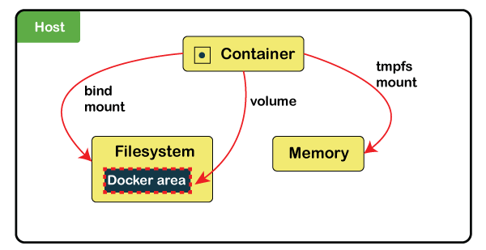

# Docker Volumes and Mounts Explained
[toc]
# TL;DR

* Volumes: Used for persistency and sharing between containers, managed by Docker.
* Bind Mounts: May be stored *anywhere* on the host system, mainly used for configuration files.


# What is Docker Volume?

**Source:** https://www.javatpoint.com/what-is-docker-volume#:~:text=Docker%20volumes%20are%20file%20systems,if%20another%20process%20needs%20it.

Docker volumes are a widely used and useful tool for ensuring data persistence while working in containers. Docker volumes are file systems mounted on Docker containers to preserve data generated by the running container.

* The data doesn't persist when that container no longer exists, and it can be difficult to get the data out of the container if another process needs it.
* A container's writable layer is tightly coupled to the host machine where the container is running. The data cannot be easily moveable somewhere else.
* Writing into a container's writable layer requires a storage driver to manage the filesystem.

Docker has two options for containers to store files in the host machine so that the files are persisted even after the container stops:

1. **Volumes** are stored in a part of the host filesystem, which is managed by
2. **Bind mounts**may be stored *anywhere* on the host system.

The volumes are stored on the host, independent of the container life cycle. This allows users to back up data and share file systems between containers easily.



### Types of Mount

In all types of mounts, the data looks the same from within the container. It is exposed as either a directory or an individual file in the container's filesystem.

**1. Volumes:**Volumes are stored in a part of the host filesystem, *managed by Docker* (/var/lib/docker/volumes/ on Linux). Non-Docker processes should not modify this part of the filesystem. Volumes are the best way to persist data in Docker. We can create a volume explicitly using the docker volume create command, or Docker can create a volume during container or service creation.

When we create a volume, it is stored within a directory on the Docker host. Volumes are managed by Docker and are isolated from the core functionality of the host machine.

A given volume can be mounted into multiple containers simultaneously. When no running container uses a volume, the volume is still available to Docker and not removed automatically. But we can remove unused volumes using Docker volume prune.

When we mount a volume, it may be ***named\*** or ***anonymous\***. Anonymous volumes are not given an explicit name when they are first mounted into a container, so Docker gives them a random name guaranteed to be unique within a given Docker host. Besides the name, named and anonymous volumes behave in the same ways.

Volumes also support *volume drivers*, allowing storing the data on remote hosts or cloud providers, among other possibilities.

**2. Bind mounts:** Bind mounts may be stored *anywhere* on the host system. They may be important system files or directories. Non-Docker processes on the Docker host or a Docker container can modify them at any time. Bind mounts have limited functionality compared to volumes.

When we use a bind mount, a file or directory on the *host machine* is mounted into a container. The file or directory is referenced by its full path on the host machine. The file or directory does not need to exist on the Docker host already. It is created on-demand if it does not yet exist.

Bind mounts are very efficient, but they rely on the host machine's filesystem, having a specific directory structure available. If we want to develop new Docker applications, then consider using named volumes instead of bind mounts. We can't use Docker CLI commands to directly manage bind mounts.

**3. tmpfsmounts:** tmpfs mounts are stored in the host system's memory only and are never written to the host system's filesystem. It is not persisted on disk, either on the Docker host or within a container.

tmpfs mount can be used during the container's lifetime to store non-persistent state or sensitive information.

**4. named pipes:** An named pipe mount can be used for communication between the Docker host and a container. The common use case is to run a third-party tool inside a container and connect to the Docker Engine API using a named pipe.

Bind mounts and volumes can both be mounted into containers using the ***-v\*** or ***--volume\*** flag, but the syntax for each is slightly different.

In Docker 17.06 and higher, we use the ***--mount\*** flag for both containers and services, for bind mounts, volumes, or tmpfs mounts.

### -v or --mount flag

The ***-v\*** or ***--volume\*** flag was used for standalone containers, and the ***--mount\*** flag was used for swarm services. However, starting with Docker 17.06, we can also use ***--mount\*** with standalone containers.

In general, ***--mount\*** is more explicit and verbose. The biggest difference is that the ***-v\*** syntax combines all the options in one field, while the ***--mount\*** syntax separates them.

New users should try ***--mount\*** syntax because it is simpler than ***--volume\*** syntax. And if the user needs to specify volume driver options, then use ***--mount\***.

**1. -v or --volume:** It consists of three fields, separated by colon characters (:). The fields must be in the correct order, but each field's meaning is not directly understandable.

* In the case of named volumes, the first field is the name of the volume, and it is unique on a given host machine. For anonymous volumes, the first field is omitted.
* The second field is the path where the file or directory is mounted in the container.
* The third field is an optional and comma-separated list of options.

**2. --mount:** It consists of multiple key-value pairs, separated by commas and each consisting of a ***<key>=<value>\*** The ***--mount\***syntax is more verbose than ***-v\*** or ***-volume\***. The order of the keys is not significant, but the flag's value is easier to understand.

* The typeof the mount, which can be ***volume, bind\***, or ***tmpfs\***.
* The destination takes as its value the path where the file or directory is mounted in the container. It may be specified as the ***destination, dst\***, or ***target\***.
* If the read-onlyoption present causes the bind mount to be mounted into the container as read-only.
* The volume-optoption, which can be specified more than once, takes a key-value pair consisting of the option name and its value.

### How to Create and Manage Volumes

**Create a volume**

Use the following command to create and manage Docker volumes outside the scope of any container.

1. $docker volume create [volume_name] 

Docker automatically creates a directory for the volume on the host under the ***/var/lib/docker/volume/path\***.

Now mount this volume on a container, ensuring data persistence and data sharing among multiple containers.

**List the volumes**

Use the following command to **list the volumes**.

1. $docker volume list  

The output displays a list of volumes, specifying their location and their volume name.

**Inspect a volume**

Use the following command to inspect a volume.

1. $docker volume inspect [volume_name] 

It lists all the details of a volume, including its location on the host file (mountpoint), and everything stored within the data volume can also be found in the directory listed under the mountpoint path.

**Mounting a Data Volume**

To mount a data volume to a container, adds the ***--mount\*** flag in the ***docker run\*** command. It adds the volume to the specified container, storing the data produced inside the virtual environment. Use the following syntax to run a container and mount a data volume to it.

1. docker run --mount source=[volume_name],destination=[path_in_container] [docker_image] 

Everything stored in that directory automatically saved on the data volume on the host as well.

**Remove a volume**

To delete a Docker volume, we need to specify its name. Use the following basic command syntax to remove a volume.

1. $docker volume rm [volume_name] 

Docker removes volumes only if they are not in use at the moment. If there is a container with the specified volume, it responds with an error.

**Delete All Volumes at Once**

Use the below command to delete all unused Docker volumes at once:

1. $docker volume prune 

The output warns once that it will remove all local volumes not used by at least one container, and then we need to confirm to continue.

# Use volumes

**Source:** https://docs.docker.com/storage/volumes/

Volumes are the preferred mechanism for persisting data generated by and used by Docker containers. While [bind mounts](https://docs.docker.com/storage/bind-mounts/) are dependent on the directory structure and OS of the host machine, volumes are completely managed by Docker. Volumes have several advantages over bind mounts:

* Volumes are easier to back up or migrate than bind mounts.
* You can manage volumes using Docker CLI commands or the Docker API.
* Volumes work on both Linux and Windows containers.
* Volumes can be more safely shared among multiple containers.
* Volume drivers let you store volumes on remote hosts or cloud providers, to encrypt the contents of volumes, or to add other functionality.
* New volumes can have their content pre-populated by a container.
* Volumes on Docker Desktop have much higher performance than bind mounts from Mac and Windows hosts.

In addition, volumes are often a better choice than persisting data in a container’s writable layer, because a volume does not increase the size of the containers using it, and the volume’s contents exist outside the lifecycle of a given container.


If your container generates non-persistent state data, consider using a [tmpfs mount](https://docs.docker.com/storage/tmpfs/) to avoid storing the data anywhere permanently, and to increase the container’s performance by avoiding writing into the container’s writable layer.

Volumes use `rprivate` bind propagation, and bind propagation is not configurable for volumes.

## Choose the -v or --mount flag

In general, `--mount` is more explicit and verbose. The biggest difference is that the `-v` syntax combines all the options together in one field, while the `--mount` syntax separates them. Here is a comparison of the syntax for each flag.

If you need to specify volume driver options, you must use `--mount`.

* `-v` or `--volume`

  : Consists of three fields, separated by colon characters (

  ```plaintext
  :
  ```

  ). The fields must be in the correct order, and the meaning of each field is not immediately obvious.

  * In the case of named volumes, the first field is the name of the volume, and is unique on a given host machine. For anonymous volumes, the first field is omitted.
  * The second field is the path where the file or directory are mounted in the container.
  * The third field is optional, and is a comma-separated list of options, such as `ro`. These options are discussed below.

* `--mount`

  : Consists of multiple key-value pairs, separated by commas and each consisting of a

   

  ```plaintext
  <key>=<value>
  ```

   

  tuple. The

   

  ```plaintext
  --mount
  ```

   

  syntax is more verbose than

   

  ```plaintext
  -v
  ```

   

  or

   

  ```plaintext
  --volume
  ```

  , but the order of the keys is not significant, and the value of the flag is easier to understand.

  * The `type` of the mount, which can be [`bind`](https://docs.docker.com/storage/bind-mounts/), `volume`, or [`tmpfs`](https://docs.docker.com/storage/tmpfs/). This topic discusses volumes, so the type is always `volume`.
  * The `source` of the mount. For named volumes, this is the name of the volume. For anonymous volumes, this field is omitted. May be specified as `source` or `src`.
  * The `destination` takes as its value the path where the file or directory is mounted in the container. May be specified as `destination`, `dst`, or `target`.
  * The `readonly` option, if present, causes the bind mount to be [mounted into the container as read-only](https://docs.docker.com/storage/volumes/#use-a-read-only-volume). May be specified as `readonly` or `ro`.
  * The `volume-opt` option, which can be specified more than once, takes a key-value pair consisting of the option name and its value.

> Escape values from outer CSV parser
>
> If your volume driver accepts a comma-separated list as an option, you must escape the value from the outer CSV parser. To escape a `volume-opt`, surround it with double quotes (`"`) and surround the entire mount parameter with single quotes (`'`).
>
> For example, the `local` driver accepts mount options as a comma-separated list in the `o` parameter. This example shows the correct way to escape the list.
>
> ```
> $ docker service create \
>     --mount 'type=volume,src=<VOLUME-NAME>,dst=<CONTAINER-PATH>,volume-driver=local,volume-opt=type=nfs,volume-opt=device=<nfs-server>:<nfs-path>,"volume-opt=o=addr=<nfs-address>,vers=4,soft,timeo=180,bg,tcp,rw"'
>     --name myservice \
>     <IMAGE>
> ```

The examples below show both the `--mount` and `-v` syntax where possible, and `--mount` is presented first.

### Differences between `-v` and `--mount` behavior

As opposed to bind mounts, all options for volumes are available for both `--mount` and `-v` flags.

When using volumes with services, only `--mount` is supported.

## Create and manage volumes

Unlike a bind mount, you can create and manage volumes outside the scope of any container.

**Create a volume**:

```
$ docker volume create my-vol
```

**List volumes**:

```
$ docker volume ls

local               my-vol
```

**Inspect a volume**:

```
$ docker volume inspect my-vol
[
    {
        "Driver": "local",
        "Labels": {},
        "Mountpoint": "/var/lib/docker/volumes/my-vol/_data",
        "Name": "my-vol",
        "Options": {},
        "Scope": "local"
    }
]
```

**Remove a volume**:

```
$ docker volume rm my-vol
```

## Start a container with a volume

If you start a container with a volume that does not yet exist, Docker creates the volume for you. The following example mounts the volume `myvol2` into `/app/` in the container.

The `-v` and `--mount` examples below produce the same result. You can’t run them both unless you remove the `devtest` container and the `myvol2` volume after running the first one.

* `--mount`
* `-v`

```
$ docker run -d \
  --name devtest \
  --mount source=myvol2,target=/app \
  nginx:latest
```

Use `docker inspect devtest` to verify that the volume was created and mounted correctly. Look for the `Mounts` section:

```
"Mounts": [
    {
        "Type": "volume",
        "Name": "myvol2",
        "Source": "/var/lib/docker/volumes/myvol2/_data",
        "Destination": "/app",
        "Driver": "local",
        "Mode": "",
        "RW": true,
        "Propagation": ""
    }
],
```

This shows that the mount is a volume, it shows the correct source and destination, and that the mount is read-write.

Stop the container and remove the volume. Note volume removal is a separate step.

```
$ docker container stop devtest

$ docker container rm devtest

$ docker volume rm myvol2
```

## Use a volume with docker-compose

A single docker compose service with a volume looks like this:

```
version: "3.9"
services:
  frontend:
    image: node:lts
    volumes:
      - myapp:/home/node/app
volumes:
  myapp:
```

On the first invocation of `docker-compose up` the volume will be created. The same volume will be reused on following invocations.

A volume may be created directly outside of compose with `docker volume create` and then referenced inside `docker-compose.yml` as follows:

```
version: "3.9"
services:
  frontend:
    image: node:lts
    volumes:
      - myapp:/home/node/app
volumes:
  myapp:
    external: true
```

For more information about using volumes with compose see [the compose reference](https://docs.docker.com/compose/compose-file/compose-file-v3/#volume-configuration-reference).

### Start a service with volumes

When you start a service and define a volume, each service container uses its own local volume. None of the containers can share this data if you use the `local` volume driver, but some volume drivers do support shared storage. Docker for AWS and Docker for Azure both support persistent storage using the Cloudstor plugin.

The following example starts a `nginx` service with four replicas, each of which uses a local volume called `myvol2`.

```
$ docker service create -d \
  --replicas=4 \
  --name devtest-service \
  --mount source=myvol2,target=/app \
  nginx:latest
```

Use `docker service ps devtest-service` to verify that the service is running:

```
$ docker service ps devtest-service

ID                  NAME                IMAGE               NODE                DESIRED STATE       CURRENT STATE            ERROR               PORTS
4d7oz1j85wwn        devtest-service.1   nginx:latest        moby                Running             Running 14 seconds ago
```

Remove the service, which stops all its tasks:

```
$ docker service rm devtest-service
```

Removing the service does not remove any volumes created by the service. Volume removal is a separate step.

#### Syntax differences for services

The `docker service create` command does not support the `-v` or `--volume` flag. When mounting a volume into a service’s containers, you must use the `--mount` flag.

### Populate a volume using a container

If you start a container which creates a new volume, as above, and the container has files or directories in the directory to be mounted (such as `/app/` above), the directory’s contents are copied into the volume. The container then mounts and uses the volume, and other containers which use the volume also have access to the pre-populated content.

To illustrate this, this example starts an `nginx` container and populates the new volume `nginx-vol` with the contents of the container’s `/usr/share/nginx/html` directory, which is where Nginx stores its default HTML content.

The `--mount` and `-v` examples have the same end result.

* `--mount`
* `-v`

```
$ docker run -d \
  --name=nginxtest \
  --mount source=nginx-vol,destination=/usr/share/nginx/html \
  nginx:latest
```

After running either of these examples, run the following commands to clean up the containers and volumes. Note volume removal is a separate step.

```
$ docker container stop nginxtest

$ docker container rm nginxtest

$ docker volume rm nginx-vol
```

## Use a read-only volume

For some development applications, the container needs to write into the bind mount so that changes are propagated back to the Docker host. At other times, the container only needs read access to the data. Remember that multiple containers can mount the same volume, and it can be mounted read-write for some of them and read-only for others, at the same time.

This example modifies the one above but mounts the directory as a read-only volume, by adding `ro` to the (empty by default) list of options, after the mount point within the container. Where multiple options are present, separate them by commas.

The `--mount` and `-v` examples have the same result.

* `--mount`
* `-v`

```
$ docker run -d \
  --name=nginxtest \
  --mount source=nginx-vol,destination=/usr/share/nginx/html,readonly \
  nginx:latest
```

Use `docker inspect nginxtest` to verify that the readonly mount was created correctly. Look for the `Mounts` section:

```
"Mounts": [
    {
        "Type": "volume",
        "Name": "nginx-vol",
        "Source": "/var/lib/docker/volumes/nginx-vol/_data",
        "Destination": "/usr/share/nginx/html",
        "Driver": "local",
        "Mode": "",
        "RW": false,
        "Propagation": ""
    }
],
```

Stop and remove the container, and remove the volume. Volume removal is a separate step.

```
$ docker container stop nginxtest

$ docker container rm nginxtest

$ docker volume rm nginx-vol
```

## Share data among machines

When building fault-tolerant applications, you might need to configure multiple replicas of the same service to have access to the same files.


There are several ways to achieve this when developing your applications. One is to add logic to your application to store files on a cloud object storage system like Amazon S3. Another is to create volumes with a driver that supports writing files to an external storage system like NFS or Amazon S3.

Volume drivers allow you to abstract the underlying storage system from the application logic. For example, if your services use a volume with an NFS driver, you can update the services to use a different driver, as an example to store data in the cloud, without changing the application logic.

## Use a volume driver

When you create a volume using `docker volume create`, or when you start a container which uses a not-yet-created volume, you can specify a volume driver. The following examples use the `vieux/sshfs` volume driver, first when creating a standalone volume, and then when starting a container which creates a new volume.

### Initial set-up

This example assumes that you have two nodes, the first of which is a Docker host and can connect to the second using SSH.

On the Docker host, install the `vieux/sshfs` plugin:

```
$ docker plugin install --grant-all-permissions vieux/sshfs
```

### Create a volume using a volume driver

This example specifies a SSH password, but if the two hosts have shared keys configured, you can omit the password. Each volume driver may have zero or more configurable options, each of which is specified using an `-o` flag.

```
$ docker volume create --driver vieux/sshfs \
  -o sshcmd=test@node2:/home/test \
  -o password=testpassword \
  sshvolume
```

### Start a container which creates a volume using a volume driver

This example specifies a SSH password, but if the two hosts have shared keys configured, you can omit the password. Each volume driver may have zero or more configurable options. **If the volume driver requires you to pass options, you must use the `--mount` flag to mount the volume, rather than `-v`.**

```
$ docker run -d \
  --name sshfs-container \
  --volume-driver vieux/sshfs \
  --mount src=sshvolume,target=/app,volume-opt=sshcmd=test@node2:/home/test,volume-opt=password=testpassword \
  nginx:latest
```

### Create a service which creates an NFS volume

This example shows how you can create an NFS volume when creating a service. This example uses `10.0.0.10` as the NFS server and `/var/docker-nfs` as the exported directory on the NFS server. Note that the volume driver specified is `local`.

#### NFSv3

```
$ docker service create -d \
  --name nfs-service \
  --mount 'type=volume,source=nfsvolume,target=/app,volume-driver=local,volume-opt=type=nfs,volume-opt=device=:/var/docker-nfs,volume-opt=o=addr=10.0.0.10' \
  nginx:latest
```

#### NFSv4

```
$ docker service create -d \
    --name nfs-service \
    --mount 'type=volume,source=nfsvolume,target=/app,volume-driver=local,volume-opt=type=nfs,volume-opt=device=:/var/docker-nfs,"volume-opt=o=addr=10.0.0.10,rw,nfsvers=4,async"' \
    nginx:latest
```

### Create CIFS/Samba volumes

You can mount a Samba share directly in docker without configuring a mount point on your host.

```
$ docker volume create \
	--driver local \
	--opt type=cifs \
	--opt device=//uxxxxx.your-server.de/backup \
	--opt o=addr=uxxxxx.your-server.de,username=uxxxxxxx,password=*****,file_mode=0777,dir_mode=0777 \
	--name cif-volume
```

Notice the `addr` option is required if using a hostname instead of an IP so docker can perform the hostname lookup.

## Backup, restore, or migrate data volumes

Volumes are useful for backups, restores, and migrations. Use the `--volumes-from` flag to create a new container that mounts that volume.

### Back up a volume

For example, create a new container named `dbstore`:

```
$ docker run -v /dbdata --name dbstore ubuntu /bin/bash
```

Then in the next command, we:

* Launch a new container and mount the volume from the `dbstore` container
* Mount a local host directory as `/backup`
* Pass a command that tars the contents of the `dbdata` volume to a `backup.tar` file inside our `/backup` directory.

```
$ docker run --rm --volumes-from dbstore -v $(pwd):/backup ubuntu tar cvf /backup/backup.tar /dbdata
```

When the command completes and the container stops, we are left with a backup of our `dbdata` volume.

### Restore volume from backup

With the backup just created, you can restore it to the same container, or another that you made elsewhere.

For example, create a new container named `dbstore2`:

```
$ docker run -v /dbdata --name dbstore2 ubuntu /bin/bash
```

Then un-tar the backup file in the new container’s data volume:

```
$ docker run --rm --volumes-from dbstore2 -v $(pwd):/backup ubuntu bash -c "cd /dbdata && tar xvf /backup/backup.tar --strip 1"
```

You can use the techniques above to automate backup, migration and restore testing using your preferred tools.

## Remove volumes

A Docker data volume persists after a container is deleted. There are two types of volumes to consider:

* **Named volumes** have a specific source from outside the container, for example `awesome:/bar`.
* **Anonymous volumes** have no specific source so when the container is deleted, instruct the Docker Engine daemon to remove them.

### Remove anonymous volumes

To automatically remove anonymous volumes, use the `--rm` option. For example, this command creates an anonymous `/foo` volume. When the container is removed, the Docker Engine removes the `/foo` volume but not the `awesome` volume.

```
$ docker run --rm -v /foo -v awesome:/bar busybox top
```

> **Note**:
>
> If another container binds the volumes with `--volumes-from`, the volume definitions are *copied* and the anonymous volume also stays after the first container is removed.

### Remove all volumes

To remove all unused volumes and free up space:

```
$ docker volume prune
```